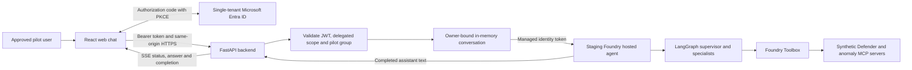
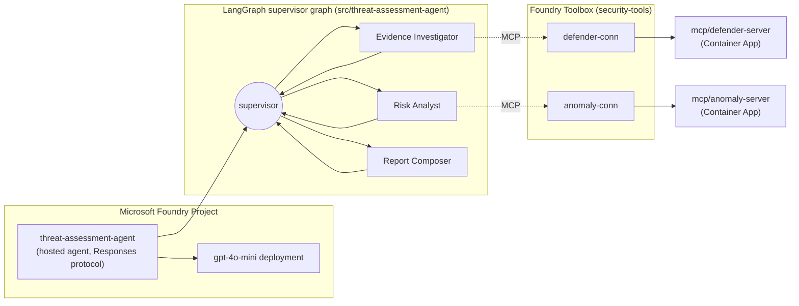

A proof of concept that hosts a LangGraph multi-agent threat-assessment workflow on **Microsoft Foundry Hosted Agents**, backed by two independent MCP tool servers (mocked Microsoft Defender and anomaly-detection data). The PoC evaluates Foundry Hosted Agents as a deployment target for Air Canada's existing LangGraph prototype and produces a decision-ready comparison against self-hosted LangGraph/LangSmith options.

📋 **Next features to implement:** see the customer enhancement backlog captured in [`assets/summary_session_002.md`](assets/summary_session_002.md) (OBO identity pass-through, reusable auth/history/telemetry frameworks, graph-path evaluation, scalability, AKS/BYOC, and more).

📖 **Full investigation notes, RBAC troubleshooting, and manual-agent workaround live in the project [wiki](../../wiki):**
[Home](../../wiki/Home) · [Architecture](../../wiki/Architecture) · [Manual Agent Workaround](../../wiki/Manual-Agent-Workaround) · [RBAC 401 Investigation](../../wiki/RBAC-401-Investigation)

🎓 **A hands-on, bilingual (EN/FR) workshop built from this PoC — 9 labs plus a companion slide deck — is published at
[devopsabcs-engineering.github.io/foundry-hosted-agents](https://devopsabcs-engineering.github.io/foundry-hosted-agents/)**
(source in [`docs/`](docs); the workshop is publicly accessible).

## Try the web chatbot

The infrastructure now targets [private Cosmos with public Foundry access](docs/private-networking.md)
([français](docs/fr/private-networking.md)), following the FSI sibling's hybrid pattern.
The migration and production release passed validation on 2026-09-16; see the
[verified release evidence](deliverables/hybrid-network-validation-20260915.md).
Cosmos checkpointing remains optional and disabled in the baseline agent.

[Open the staging chatbot](https://foundry-threat-chat-staging.purpletree-432267ca.eastus2.azurecontainerapps.io/)
and sign in with an approved member of **Foundry Threat Assessment Pilot** in the
`MngEnvMCAP675646.onmicrosoft.com` tenant. The initial approved member is the tenant
administrator. A same-tenant account without pilot membership is not sufficient.

The pilot is a React chat frontend and FastAPI backend in a separate Azure Container App.
It calls the existing staging hosted agent using a dedicated managed identity. It does
not redeploy the agent, expose Azure credentials to the browser, or provide a production
web frontend. Public HTTPS ingress is protected by application authentication; it is
**not a network-private deployment**. The landing page and health endpoint are public.



On 2026-09-08, the pilot administrator signed in and received a device-risk report
for the synthetic `device-001` fixture through the web UI. The startup-fixed image
also passed its real managed-identity construction check and 23 backend tests.
This verifies the pilot path, not real Defender telemetry or enterprise readiness.

| Destination | Purpose |
| --- | --- |
| [Web chatbot](https://foundry-threat-chat-staging.purpletree-432267ca.eastus2.azurecontainerapps.io/) | Try the signed-in staging pilot |
| [Health check](https://foundry-threat-chat-staging.purpletree-432267ca.eastus2.azurecontainerapps.io/healthz) | Process health only; does not invoke the agent |
| [Web Chat Pilot wiki](https://github.com/devopsabcs-engineering/foundry-hosted-agents/wiki/Web-Chat-Pilot) | Identity, diagrams, deployment, recovery, verification and Teams roadmap |
| [Web Chat Build workflow](https://github.com/devopsabcs-engineering/foundry-hosted-agents/actions/workflows/web-chat-build.yml) | Hosted dependency installation, tests and frontend artifacts |
| [Continuous Test Trends](https://github.com/devopsabcs-engineering/foundry-hosted-agents/wiki/Continuous-Test-Trends) | Agent evaluation and load evidence, separate from web UI verification |

Try: `Assess device ID: device-001 and list its vulnerabilities.`
Use synthetic or approved pilot data only. Responses contain simulated security findings,
not an instruction to perform remediation.

Tool lookups require explicit fields: `device ID: device-001`, `account ID: jsmith`,
or `data_egress_mb_per_hour=900` / `failed_logins_per_hour=10`. Device IDs trigger both
Defender lookups; account IDs trigger login analysis; supported numeric metrics trigger
anomaly scoring. Assistant text cannot supply identifiers. Later explicit user fields
replace earlier fields of the same category; follow-ups without new fields retain them.
Free-form names without these labels do not trigger lookups, and percentages are not raw metrics.

Conversations are session-only: one backend process and one replica, five conversations
per user, a one-hour idle expiry, and at most 20 successful turns per conversation.
Reloading the page loses its local conversation list; restarting the backend loses all
conversation state. Do not scale out until a shared, owner-bound session store is implemented.
The UI shows progress while the agent runs, then the completed answer, not token-by-token text.
Teams is not deployed; see the wiki for the tab and native-bot options and their security gates.

The graph carries user/assistant history to all three specialists. The web pilot submits
the complete conversation on each request with `store: false`; it does not use Foundry
conversation persistence. All callers must submit full user/assistant history in `input`,
set `store: false`, and omit `conversation` and `previous_response_id`. The converter rejects
unsupported persistence instead of silently losing context. The default `azd ai agent invoke`
conversation mode is not supported; release smoke checks use `scripts/invoke-agent.sh`, which
creates a fresh version-pinned session and sends a nonpersistent Responses request.
The release gate checks reference retention, full-history follow-up, and independent-request isolation.
See the [pilot verification record](https://github.com/devopsabcs-engineering/foundry-hosted-agents/wiki/Web-Chat-Pilot#verification-record).

Completed web message retries use a conversation-scoped `Idempotency-Key`: the same key and
text replay the stored answer without another agent call or turn. Changed text with a used
key returns 409. This guarantee lasts only for the in-memory session, not across restarts;
failed remote calls may still consume compute, and creating a new conversation is not deduplicated.

## Architecture



* **Supervisor + specialists** — `graph.py` compiles a LangGraph `StateGraph` where a supervisor routes to three specialist nodes (Evidence Investigator, Risk Analyst, Report Composer) and only proceeds to reporting once both evidence and risk analysis are complete.
* **Tool isolation by role** — each specialist is restricted to a single Foundry Toolbox connection (Evidence Investigator → `defender-conn`, Risk Analyst → `anomaly-conn`); the Report Composer has no tool access and only synthesizes.
* Specialists use the authenticated, version-pinned toolbox MCP endpoint through [toolbox.py](src/threat-assessment-agent/toolbox.py), with exact read-only tool allowlists. Connections must use the ARM `RemoteTool` category; `GenericHttp` with anonymous authentication fails toolbox resolution. The obsolete per-agent tool-resolution API is no longer used.
* **MCP servers run independently** of the agent process — `mcp/defender-server` and `mcp/anomaly-server` are separate FastMCP apps, each deployed as its own Azure Container App and reached only via the Foundry Toolbox `remote-tool` connections declared in `azure.yaml`.

## Repository layout

| Path | Purpose |
| --- | --- |
| [`azure.yaml`](azure.yaml) | `azd` project manifest: Foundry project, model deployment, Toolbox connections, and the hosted agent service definition. |
| [apps/web-chat/](apps/web-chat/) | React/MSAL frontend, authenticated FastAPI backend, Docker image and authorization/session/stream tests. |
| [infra/web-chat.bicep](infra/web-chat.bicep) | Separate staging web Container App and managed identity, registry pull and project-scoped Foundry roles. |
| [scripts/setup-web-chat-identity.ps1](scripts/setup-web-chat-identity.ps1) | Administrator-run Entra app registration, SPA callbacks, delegated consent and pilot-group assignment. |
| [scripts/deployment_summary.py](scripts/deployment_summary.py) | Shared clickable deployment inventory for Actions summaries. |
| [`src/threat-assessment-agent/`](src/threat-assessment-agent) | The LangGraph agent: `graph.py` (supervisor + specialist nodes), `state.py` (graph state schema, optional Cosmos DB checkpointer extension point), `main.py` (Foundry Responses-protocol host entry point), `tests/`. |
| [`mcp/defender-server/`](mcp/defender-server) | Mocked Microsoft Defender MCP tool server (`get_device_risk`, `list_vulnerabilities`). |
| [`mcp/anomaly-server/`](mcp/anomaly-server) | Mocked anomaly-detection MCP tool server (`score_anomaly`, `detect_login_anomalies`). |
| [`infra/`](infra) | Bicep infrastructure: `main.bicep` composes `modules/ai-foundry.bicep`, `modules/monitoring.bicep`, `modules/rbac.bicep`, and `modules/mcp-container-apps.bicep`. `modules/cosmos-db.bicep` is a standalone, optional module used only by the Cosmos checkpointer experiment. |
| [`eval/`](eval) | Evaluation suite gated against `golden-dataset.jsonl`: `deterministic-tests/` (non-LLM schema/policy checks) and `rubrics/` (built-in Foundry evaluators plus custom LLM-as-judge rubrics — see [`eval/rubrics/README.md`](eval/rubrics/README.md)). |
| [`.github/workflows/`](.github/workflows) | Shared protected release, compatibility release entry point, continuous validation, web build and test-trend publication. |
| [`experiments/`](experiments) | Phase 7 production-readiness probes: `load-testing/` (concurrent-session and cold-start measurements), `cosmos-checkpointer/` (optional persistent-state extension validation), `agent365-onboarding/` (Entra Agent ID / Agent 365 licensing probe), `continuous-evaluation/` (scheduled evaluation rule deployment). |
| [`deliverables/`](deliverables) | Decision materials for the engagement: `production-decision-gate-scorecard.md`, `deck-outline.md`, and the compiled `air-canada-foundry-hosted-agents-decision.pptx`. |
| [`docs/`](docs) | Bilingual (EN/FR) GitHub Pages workshop built from this PoC: `index.md` + `labs/` (English), `fr/` (French mirror), and `assets/decks/` (companion PPTX decks, generated by `scripts/build-workshop-deck.js`). |
| [`scripts/`](scripts) | `build-deck.js` (generates the decision deck via vendored `pptxgenjs`) and `test_mcp_servers.py` (ad hoc smoke probe against the deployed MCP Container Apps). |

## Getting started

### Continuous test reporting

[Continuous validation and trend publishing](docs/continuous-validation.md) adds offline push/PR checks,
main-push staging evaluations and five-request load probes, Actions summaries, and run-linked wiki charts.
It does not deploy or promote. Automatic wiki publication requires `WIKI_PUSH_TOKEN` and the workflows
on `main`; see the setup and replay instructions before treating the pipeline as operational.

### Prerequisites

* [Azure Developer CLI (`azd`)](https://learn.microsoft.com/azure/developer/azure-developer-cli/install-azd) with the Foundry extension: `azd ext install microsoft.foundry`
* Python 3.13
* An Azure subscription with access to Microsoft Foundry and a `gpt-4o-mini` model quota

### Provision and deploy

```powershell
azd auth login
azd env new air-canada-threat-assessment-poc
azd provision
azd deploy
```

### Run and test the agent

```powershell
azd ai agent show
azd ai agent invoke "Hello from local testing. Reply with a short confirmation that you are running and ready to assess threats."
```

### Local development

```powershell
python -m venv .venv
./.venv/Scripts/Activate.ps1
pip install -r src/threat-assessment-agent/requirements.txt -r src/threat-assessment-agent/requirements-dev.txt
pytest src/threat-assessment-agent/tests/ -v
```

## Evaluation

The golden scenarios use explicit synthetic device/account identifiers and matching mock records.
Unknown identifiers return missing-data results, not invented anomalies or evidence of safety.
The original incident accompanies each specialist handoff. Final-report task adherence uses
the Report Composer's actual instructions; deterministic checks separately enforce specialist
receipts, allowed connections, citations, and safety policy. All eight cases and the 100% gate remain.
Passing these fixtures demonstrates workflow behavior, not real Defender detection accuracy.

* **Deterministic checks** (`eval/deterministic-tests/`): schema validity, required citations, forbidden phrases, allowed-tool-call policy, degraded-mode policy, and conflict acknowledgement — run with `pytest eval/deterministic-tests/`.
* **Rubric-based / LLM-as-judge evaluation** (`eval/rubrics/`): built-in Foundry evaluators (coherence, groundedness, task adherence, tool-call accuracy) plus custom rubrics for triage correctness, evidence-citation quality, and conflicting-signal handling — see [`eval/rubrics/README.md`](eval/rubrics/README.md) for the full gating-criterion mapping.

## CI/CD

* [Hosted Agent CI/CD](.github/workflows/hosted-agent-cd.yml) is a manual compatibility entry point that calls the shared protected release. It no longer deploys directly to production.
* [Deploy and Evaluate](.github/workflows/deploy-and-evaluate.yml) supports manual dispatch and reusable calls: lint and unit tests, Bicep validation, immutable staging deployment, smoke/contract/conversation tests, golden evaluation, production approval, promotion and monitoring.

Both workflows authenticate via secretless OIDC federation (no stored client secrets).
The called workflow owns the shared deployment queue, preventing overlapping releases.
Repeat provisioning targets existing resources and role assignments, but each deployment
can create a new immutable agent version. Model wording, timing and telemetry are not
deterministic. Trend publication replaces the same run/attempt record instead of adding duplicates.

[Web Chat Build](.github/workflows/web-chat-build.yml) is separate: scoped push/PR checks
and manual dispatch run backend tests, frontend stream tests and `npm ci`/Vite compilation
on GitHub-hosted runners. It does **not** deploy to Azure. The wiki records the operator-run
ACR remote build and digest-pinned Bicep deployment; no local npm policy bypass is required.
The web build, continuous validation, both release entry points and trend-publishing workflows
include a **Deployment Links** section in their summaries. Links identify existing targets;
they do not certify that a particular run deployed or tested those targets.

The staging release workflow builds MCP images from the selected commit and pins them by digest.
Staging uses dedicated `mcp-staging-*` Container Apps and an image-pull identity, leaving the
existing `mcp-*` production apps unchanged. It rejects shared MCP URLs before deploying the agent.
Production requires environment approval. After approval, promotion provisions the production
MCP apps with the exact image digests evaluated in staging and rebuilds the evaluated agent source.
Review the production toolbox version together with the candidate. Before provisioning, the workflow
resolves the currently routed production version from Foundry and records its active status for
manual recovery; missing or ambiguous routing blocks promotion.

## Verified release and WI-11 resolution

[Run 34424741660](https://github.com/devopsabcs-engineering/foundry-hosted-agents/actions/runs/34424741660)
passed all seven protected release jobs on source `20a5a35`. Staging version 13 passed
all three conversation checks, eight captures, zero deterministic policy failures, and
21 of 21 model-judge checks. Production version 36 was active before and after this
repeat deployment. Its smoke response produced one correlated telemetry row and zero
exceptions in the checked ten-minute window. Both deployment approvals used the configured
reviewer gate; no manual approval remains for this run.

[Continuous validation 34422212544](https://github.com/devopsabcs-engineering/foundry-hosted-agents/actions/runs/34422212544)
also passed on source `a7149db`: 198 offline tests, eight hosted captures, and five
concurrent streams with zero errors (p95 23.489 seconds). This bounded result does not
establish the cause or resolution of older intermittent SSE failures.

The preceding release `34422215632` promoted version 35 to 36 and passed smoke but
failed monitoring because the response-ID extractor retained JSON quotes. Direct queries
confirmed ingestion and zero exceptions. The successful repeat fixes raw-ID extraction
without relaxing either gate; the preceding run remains recorded as failed.

[Run 34300982257](https://github.com/devopsabcs-engineering/foundry-hosted-agents/actions/runs/34300982257)
passed the protected staging-to-production pipeline on source `4b6f8d2`. Staging
version 10 completed eight captures, zero deterministic policy failures, and 21 of 21
model-judge checks. Production advanced from version 34 to 35 and passed monitoring.
The compatibility entry point repeated the full protected release successfully in
[run 34302149559](https://github.com/devopsabcs-engineering/foundry-hosted-agents/actions/runs/34302149559),
including its separate production monitoring approval and checks.

Those historical monitoring checks did not prove telemetry ingestion. Subsequent staging
investigation found that the hosting SDK could not discover an Application Insights connection.
The infrastructure now creates the project connection, and the production monitoring gate
requires a trace correlated to the smoke response before applying its zero-exception threshold.
Missing telemetry fails the gate; it is not evidence of a healthy deployment.

Investigation found two native-history blockers: the SDK used the project route for agent-scoped
conversations, and the hosted agent identity could not read the caller's isolated conversation.
The route-only experiment in
[run 34418932490](https://github.com/devopsabcs-engineering/foundry-hosted-agents/actions/runs/34418932490)
failed staging smoke and never reached production. The pilot therefore uses explicit full-history
requests, verified live through a version-pinned staging session. Native persistence and durable
web history remain out of scope. Intermittent concurrent SSE failures are not yet explained.

The release preserves conversation context, executes read-only tool plans from explicit
user fields, labels synthetic tool findings, and retains omitted user references in an
unverified section. It does not promote those references to verified security evidence.
WI-11 is resolved for this implementation, without claiming a confirmed
server-side root cause or closure of support request `2609040400007027`.

See the wiki's [Release Evidence](../../wiki/Release-Evidence),
[Operations](../../wiki/Operations), and [WI-11 history](../../wiki/RBAC-401-Investigation).
The [evidence report](assets/release-evidence/index.html) and
[hashed source artifacts](assets/release-evidence/manifest.json) retain historical
proof for run 34178081808; the wiki links the newer workflow evidence separately.
These are synthetic security fixtures: a green PoC release is not enterprise production
certification, a sustained-load test, or evidence of complete distributed tracing.
