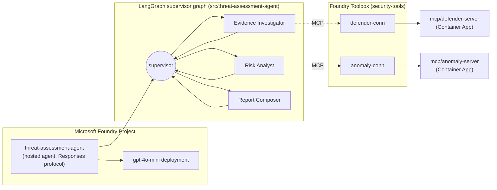

# Air Canada Threat & Vulnerability Assessment Agent — Foundry Hosted Agents PoC

A proof of concept that hosts a LangGraph multi-agent threat-assessment workflow on **Microsoft Foundry Hosted Agents**, backed by two independent MCP tool servers (mocked Microsoft Defender and anomaly-detection data). The PoC evaluates Foundry Hosted Agents as a deployment target for Air Canada's existing LangGraph prototype and produces a decision-ready comparison against self-hosted LangGraph/LangSmith options.

📖 **Full investigation notes, RBAC troubleshooting, and manual-agent workaround live in the project [wiki](../../wiki):**
[Home](../../wiki/Home) · [Architecture](../../wiki/Architecture) · [Manual Agent Workaround](../../wiki/Manual-Agent-Workaround) · [RBAC 401 Investigation](../../wiki/RBAC-401-Investigation)

## Architecture



* **Supervisor + specialists** — `graph.py` compiles a LangGraph `StateGraph` where a supervisor routes to three specialist nodes (Evidence Investigator, Risk Analyst, Report Composer) and only proceeds to reporting once both evidence and risk analysis are complete.
* **Tool isolation by role** — each specialist is restricted to a single Foundry Toolbox connection (Evidence Investigator → `defender-conn`, Risk Analyst → `anomaly-conn`); the Report Composer has no tool access and only synthesizes.
* **Graceful tool-resolution degradation** — `main.py` wraps Foundry's tool-resolution step so that a known platform-side gap (tool registry 404) degrades to an honestly-labeled plain-LLM analysis instead of crashing the request (see `state.py`'s `evidence_tool_unavailable` / `risk_tool_unavailable` flags).
* **MCP servers run independently** of the agent process — `mcp/defender-server` and `mcp/anomaly-server` are separate FastMCP apps, each deployed as its own Azure Container App and reached only via the Foundry Toolbox `remote-tool` connections declared in `azure.yaml`.

## Repository layout

| Path | Purpose |
|---|---|
| [`azure.yaml`](azure.yaml) | `azd` project manifest: Foundry project, model deployment, Toolbox connections, and the hosted agent service definition. |
| [`src/threat-assessment-agent/`](src/threat-assessment-agent) | The LangGraph agent: `graph.py` (supervisor + specialist nodes), `state.py` (graph state schema, optional Cosmos DB checkpointer extension point), `main.py` (Foundry Responses-protocol host entry point), `tests/`. |
| [`mcp/defender-server/`](mcp/defender-server) | Mocked Microsoft Defender MCP tool server (`get_device_risk`, `list_vulnerabilities`). |
| [`mcp/anomaly-server/`](mcp/anomaly-server) | Mocked anomaly-detection MCP tool server (`score_anomaly`, `detect_login_anomalies`). |
| [`infra/`](infra) | Bicep infrastructure: `main.bicep` composes `modules/ai-foundry.bicep`, `modules/monitoring.bicep`, `modules/rbac.bicep`, and `modules/mcp-container-apps.bicep`. `modules/cosmos-db.bicep` is a standalone, optional module used only by the Cosmos checkpointer experiment. |
| [`eval/`](eval) | Evaluation suite gated against `golden-dataset.jsonl`: `deterministic-tests/` (non-LLM schema/policy checks) and `rubrics/` (built-in Foundry evaluators plus custom LLM-as-judge rubrics — see [`eval/rubrics/README.md`](eval/rubrics/README.md)). |
| [`.github/workflows/`](.github/workflows) | `hosted-agent-cd.yml` (manual provision/deploy/smoke-test straight to the PoC environment) and `deploy-and-evaluate.yml` (lint → Bicep validate → staging deploy → smoke/contract/streaming tests → offline evaluation quality gate → manual production promotion). |
| [`experiments/`](experiments) | Phase 7 production-readiness probes: `load-testing/` (concurrent-session and cold-start measurements), `cosmos-checkpointer/` (optional persistent-state extension validation), `agent365-onboarding/` (Entra Agent ID / Agent 365 licensing probe), `continuous-evaluation/` (scheduled evaluation rule deployment). |
| [`deliverables/`](deliverables) | Decision materials for the engagement: `production-decision-gate-scorecard.md`, `deck-outline.md`, and the compiled `air-canada-foundry-hosted-agents-decision.pptx`. |
| [`scripts/`](scripts) | `build-deck.js` (generates the decision deck via vendored `pptxgenjs`) and `test_mcp_servers.py` (ad hoc smoke probe against the deployed MCP Container Apps). |

## Getting started

### Prerequisites

* [Azure Developer CLI (`azd`)](https://learn.microsoft.com/azure/developer/azure-developer-cli/install-azd) with the Foundry extension: `azd ext install microsoft.foundry`
* Python 3.13
* An Azure subscription with access to Microsoft Foundry and a `gpt-4o-mini` model quota

### Provision and deploy

```powershell
azd auth login
azd env new air-canada-threat-assessment-poc
azd provision
azd deploy
```

### Run and test the agent

```powershell
azd ai agent show
azd ai agent invoke "Hello from local testing. Reply with a short confirmation that you are running and ready to assess threats."
```

### Local development

```powershell
python -m venv .venv
./.venv/Scripts/Activate.ps1
pip install -r src/threat-assessment-agent/requirements.txt -r src/threat-assessment-agent/requirements-dev.txt
pytest src/threat-assessment-agent/tests/ -v
```

## Evaluation

* **Deterministic checks** (`eval/deterministic-tests/`): schema validity, required citations, forbidden phrases, allowed-tool-call policy, degraded-mode policy, and conflict acknowledgement — run with `pytest eval/deterministic-tests/`.
* **Rubric-based / LLM-as-judge evaluation** (`eval/rubrics/`): built-in Foundry evaluators (coherence, groundedness, task adherence, tool-call accuracy) plus custom rubrics for triage correctness, evidence-citation quality, and conflicting-signal handling — see [`eval/rubrics/README.md`](eval/rubrics/README.md) for the full gating-criterion mapping.

## CI/CD

* **`hosted-agent-cd.yml`** — manual-dispatch pipeline that provisions and deploys straight to the shared PoC environment, then runs a smoke-test invoke.
* **`deploy-and-evaluate.yml`** — manual-dispatch, eval-gated release flow: lint and unit tests → Bicep validate/what-if → deploy an immutable candidate to staging → smoke/contract/streaming tests → offline evaluation quality gate → manual production approval → promote.

Both workflows authenticate via secretless OIDC federation (no stored client secrets).

## Known issues

WI-11 (a persistent `401 PermissionDenied` on Azure OpenAI calls from the hosted agent's Instance Identity, confirmed as a platform-side bug with RBAC configuration verified correct) is tracked via Azure support request `2609040400007027`. Full diagnostic history is in the wiki's [RBAC 401 Investigation](../../wiki/RBAC-401-Investigation) page.

