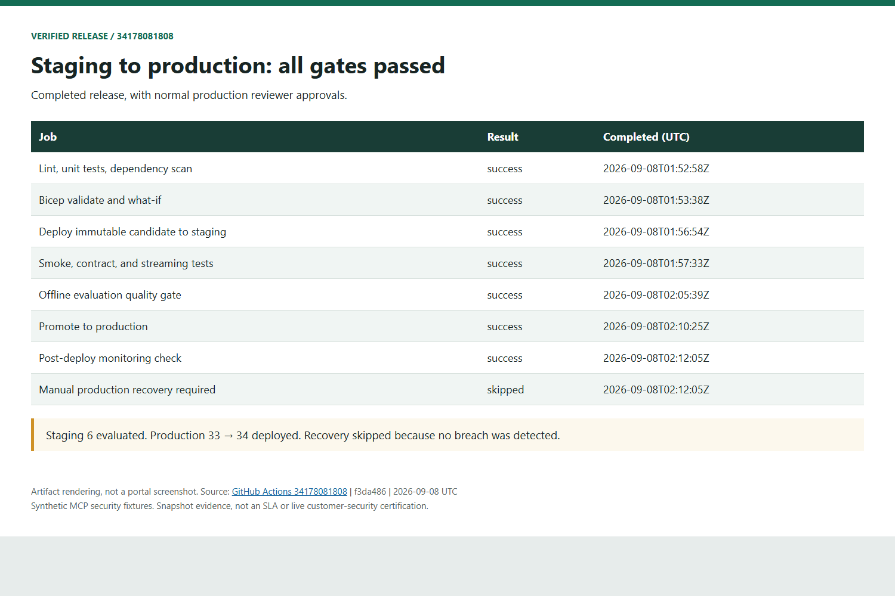

> 🇬🇧 **[English version](../)**

Bienvenue dans l'**Atelier Foundry Hosted Agents** — un atelier pratique et
progressif construit directement à partir d'une véritable preuve de
concept : héberger un **système multi-agent LangGraph d'évaluation des
menaces** sur **Microsoft Foundry Hosted Agents**, appuyé par des serveurs
d'outils MCP indépendants exécutés sur Azure Container Apps.

Vous déploierez les serveurs d'outils MCP, provisionnerez un projet
Foundry et un agent hébergé, l'invoquerez, le soumettrez à des évaluations
déterministes et de type LLM-as-judge, parcourrez le pipeline CI/CD qui
promeut un candidat en production, puis étudierez WI-11, désormais résolu
opérationnellement. Vous distinguerez le rétablissement observé d'une
cause racine de plateforme qui reste non confirmée.

> [!NOTE]
> Cet atelier est construit à partir du dépôt
> [`foundry-hosted-agents`](https://github.com/devopsabcs-engineering/foundry-hosted-agents)
> Les déploiements et évaluations sont réels ; les outils MCP utilisent des
> données de sécurité synthétiques, pas des données client réelles. Les
> extraits historiques sont distingués des résultats actuels.

## Mise en production vérifiée : 8 septembre 2026

L'[exécution 34178081808](https://github.com/devopsabcs-engineering/foundry-hosted-agents/actions/runs/34178081808)
a réussi les sept jobs de publication : staging version 6, huit captures,
21/21 vérifications par juges, approbations normales, production version 34
et test de fumée ciblant cette version. WI-11 est résolu opérationnellement.

Consultez les [preuves de publication](https://github.com/devopsabcs-engineering/foundry-hosted-agents/wiki/Release-Evidence)
et le [guide opérationnel](https://github.com/devopsabcs-engineering/foundry-hosted-agents/wiki/Operations).
Les images sont des rendus d'artefacts, pas des captures du portail. La
récupération reste manuelle ; zéro exception récente ne prouve ni
l'endurance ni le traçage distribué complet.

## À qui s'adresse cet atelier ?

| Public | Ce que vous apprendrez |
| --- | --- |
| **Ingénieurs IA / plateforme** | Déployer un système multi-agent LangGraph sur Foundry Hosted Agents de bout en bout |
| **Ingénieurs DevOps** | Câbler des pipelines CI/CD contrôlés par des évaluations autour d'un déploiement d'agent |
| **Architectes de solutions** | Comparer Foundry Hosted Agents aux options LangGraph/LangSmith auto-hébergées |
| **Ingénieurs support / SRE** | Apprendre une méthode rigoureuse de dépannage des permissions RBAC Azure |

## Prérequis

Avant de commencer le Lab 00, assurez-vous de disposer des éléments
suivants :

- [Visual Studio Code](https://code.visualstudio.com/) (dernière version stable)
- [Python](https://www.python.org/) 3.13
- [Azure Developer CLI (`azd`)](https://learn.microsoft.com/azure/developer/azure-developer-cli/install-azd)
- [Azure CLI (`az`)](https://learn.microsoft.com/cli/azure/install-azure-cli)
- Un abonnement Azure avec accès à Microsoft Foundry et un quota de modèle `gpt-4o-mini`
- Un [compte GitHub](https://github.com/) avec accès à GitHub Copilot (facultatif, utilisé au Lab 01)

## Labs

| # | Lab | Durée | Niveau |
| --- | ----- | ---------- | ------- |
| 00 | [Prérequis et configuration de l'environnement](labs/lab-00-setup.md) | 20 min | Débutant |
| 01 | [Plongée dans l'architecture](labs/lab-01-architecture.md) | 30 min | Débutant |
| 02 | [Déployer les serveurs d'outils MCP](labs/lab-02-mcp-servers.md) | 30 min | Intermédiaire |
| 03 | [Provisionner et déployer l'agent hébergé](labs/lab-03-deploy-agent.md) | 35 min | Intermédiaire |
| 04 | [Invoquer l'agent et lire les traces](labs/lab-04-invoke-agent.md) | 30 min | Intermédiaire |
| 05 | [Évaluations : déterministes + LLM-as-judge](labs/lab-05-evaluations.md) | 40 min | Intermédiaire |
| 06 | [CI/CD : pipeline de mise en production contrôlé par évaluation](labs/lab-06-cicd.md) | 35 min | Avancé |
| 07 | [Dépannage réel : erreur RBAC 401](labs/lab-07-troubleshooting-rbac.md) | 40 min | Avancé |
| 08 | [Préparation à la production et portes de décision](labs/lab-08-production-readiness.md) | 30 min | Avancé |
| 09 | [Nettoyage et arrêt des coûts](labs/lab-09-teardown.md) | 10-20 min | Débutant |

## Horaire de l'atelier

### Demi-journée (3 heures)

| Heure | Activité |
| ------ | ---------- |
| 0:00 – 0:20 | Lab 00 : Prérequis |
| 0:20 – 0:50 | Lab 01 : Plongée dans l'architecture |
| 0:50 – 1:20 | Lab 02 : Déployer les serveurs d'outils MCP |
| 1:20 – 1:55 | Lab 03 : Provisionner et déployer l'agent hébergé |
| 1:55 – 2:10 | Pause |
| 2:10 – 2:40 | Lab 04 : Invoquer l'agent et lire les traces |
| 2:40 – 3:00 | Lab 05 : Évaluations (début) |

### Journée complète (6 heures)

| Heure | Activité |
| ------ | ---------- |
| 0:00 – 3:00 | Labs de la demi-journée (ci-dessus) |
| 3:00 – 3:15 | Pause |
| 3:15 – 3:40 | Lab 05 : Évaluations (suite) |
| 3:40 – 4:15 | Lab 06 : Pipeline CI/CD |
| 4:15 – 4:55 | Lab 07 : Dépannage réel : erreur RBAC 401 |
| 4:55 – 5:10 | Pause |
| 5:10 – 5:40 | Lab 08 : Préparation à la production et portes de décision |
| 5:40 – 6:00 | Lab 09 : Nettoyage, vérification et questions |

## Niveaux de livraison

| Niveau | Labs | Durée | Public |
| --- | --- | --- | --- |
| **Demi-journée** | Labs 00 – 05 (début), puis 09 | ~3 heures + nettoyage | Première exposition à Foundry Hosted Agents |
| **Journée complète** | Labs 00 – 09 | ~6 heures | Déploiement, évaluation, contrôles CI locaux, dépannage et nettoyage |

Les durées sont indicatives, pas des garanties de provisionnement. Prévoyez du
temps pour installer les outils, construire les images et résoudre les délais
de quota ou de propagation des identités. Réservez le nettoyage même en cas d'échec.

## Pour commencer

1. Clonez ou forkez le dépôt [`foundry-hosted-agents`](https://github.com/devopsabcs-engineering/foundry-hosted-agents).
2. Complétez le [Lab 00 : Prérequis](labs/lab-00-setup.md) pour configurer votre environnement.
3. Progressez dans les labs dans l'ordre — chaque lab s'appuie sur le précédent.

> [!IMPORTANT]
> Les Labs 02-04 créent les ressources dans votre groupe apprenant jetable
> approuvé. N'utilisez pas les points de terminaison clients historiques ni les
> environnements GitHub partagés. Terminez le [Lab 09](labs/lab-09-teardown.md)
> avant de partir, même si le déploiement a échoué.

## Deck de présentation

Un deck de présentation compagnon (anglais et français) est disponible pour
une animation par un formateur :

- [Deck d'aperçu — Anglais (PPTX)](../assets/decks/foundry-hosted-agents-workshop-en.pptx)
- [Deck d'aperçu de l'atelier — Français (PPTX)](../assets/decks/foundry-hosted-agents-workshop-fr.pptx)

## Ressources connexes

| Ressource | Description |
| ------------ | ------------- |
| [Dépôt `foundry-hosted-agents`](https://github.com/devopsabcs-engineering/foundry-hosted-agents) | Code source complet du PoC, infra, suite d'évaluation et pipelines CI/CD |
| [Wiki du projet](https://github.com/devopsabcs-engineering/foundry-hosted-agents/wiki) | Notes d'architecture, contournement manuel de l'agent, journal d'investigation RBAC 401 |
| [Livrables de décision](https://github.com/devopsabcs-engineering/foundry-hosted-agents/tree/main/deliverables) | Grille de décision de mise en production et deck de décision exécutif |

## Licence

Ce projet est sous licence [MIT](https://github.com/devopsabcs-engineering/foundry-hosted-agents/blob/main/LICENSE).
