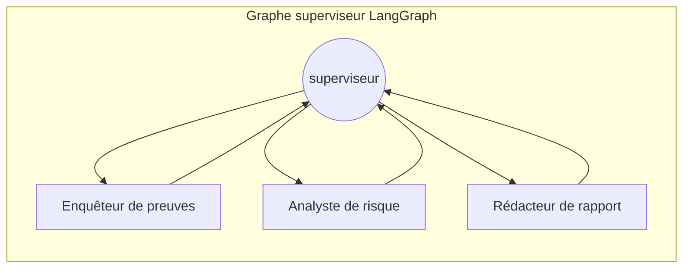

> 🇬🇧 **[English version](../../labs/lab-01-architecture)**

## Aperçu

| | |
|---|---|
| **Durée** | 30 minutes |
| **Niveau** | Débutant |
| **Prérequis** | [Lab 00](lab-00-setup.md) |

## Objectifs d'apprentissage

À la fin de ce lab, vous serez capable de :

* Expliquer le patron superviseur/spécialistes de LangGraph utilisé par cet agent
* Identifier les quatre couches architecturales impliquées pour donner des outils à un agent (implémentation, hébergement, enregistrement, consommation)
* Lire `azure.yaml` et faire correspondre chaque bloc à une ressource Azure déployée
* Expliquer pourquoi les serveurs d'outils MCP sont déployés indépendamment de l'agent

## Exercices

### Exercice 1.1 : Le graphe superviseur/spécialistes

Ouvrez [`src/threat-assessment-agent/graph.py`](https://github.com/devopsabcs-engineering/foundry-hosted-agents/blob/main/src/threat-assessment-agent/graph.py).

Un nœud **superviseur** route vers trois nœuds **spécialistes** et
n'autorise le graphe à passer à la rédaction du rapport que lorsque
l'analyse des preuves et l'analyse de risque sont toutes deux terminées :

| Nœud | Rôle | Accès aux outils |
|---|---|---|
| Enquêteur de preuves | Recueille le contexte des appareils/vulnérabilités | `defender-conn` uniquement |
| Analyste de risque | Note les anomalies et les schémas de connexion | `anomaly-conn` uniquement |
| Rédacteur de rapport | Synthétise le rapport final | Aucun — synthèse en lecture seule |

Cette isolation des outils par rôle est délibérée : aucun nœud ne peut
appeler tous les outils, et le Rédacteur de rapport — le nœud qui produit
la sortie visible par le client — ne peut appeler *aucun* outil. Trouvez
les constantes `EVIDENCE_INVESTIGATOR_PROMPT`, `RISK_ANALYST_PROMPT` et
`REPORT_COMPOSER_PROMPT` dans `graph.py` et notez que chaque prompt ne
décrit que les outils que ce nœud est autorisé à utiliser.

### Exercice 1.2 : Dégradation gracieuse de la résolution d'outils

Ouvrez [`src/threat-assessment-agent/state.py`](https://github.com/devopsabcs-engineering/foundry-hosted-agents/blob/main/src/threat-assessment-agent/state.py)
et trouvez les indicateurs `evidence_tool_unavailable` /
`risk_tool_unavailable`.

`main.py` enveloppe l'étape de résolution d'outils de Foundry pour qu'une
lacune connue côté plateforme dégrade vers une analyse LLM simple
honnêtement étiquetée, plutôt que de faire planter la requête. C'est un
véritable patron de préparation à la production : lorsqu'une dépendance
dont votre graphe a besoin n'est pas disponible, échouez de manière
*visible et honnête* dans la sortie, pas silencieusement ni par un crash.

### Exercice 1.3 : Les quatre couches d'outils

Les outils MCP ne "font pas partie de l'agent" — ils traversent quatre
couches distinctes. Lisez `azure.yaml` à la racine du dépôt et associez
chaque bloc à une couche :

| Couche | Ce qu'elle fait | Bloc `azure.yaml` |
|---|---|---|
| 1. Implémentation | Le code réel du serveur MCP (outils Defender, outils anomalie) | `mcp/defender-server/`, `mcp/anomaly-server/` (pas dans `azure.yaml` — services `azd` séparés, voir Lab 02) |
| 2. Hébergement | Runtime Azure indépendant avec sa propre authentification, réseau, vérifications de santé | Déployé en tant qu'Azure Container Apps |
| 3. Enregistrement | Définit le point de terminaison + la politique d'identifiants par serveur MCP | `anomaly-conn` / `defender-conn` (`host: azure.ai.connection`) |
| 4. Consommation | Agrège les outils enregistrés pour réutilisation entre agents | `security-tools` (`host: azure.ai.toolbox`) |

> [!IMPORTANT]
> La Foundry Toolbox est la couche d'**enregistrement/agrégation**, pas le
> runtime d'hébergement de votre code de serveur MCP. Vos serveurs MCP ont
> quand même besoin d'un endroit où s'exécuter — dans ce PoC, c'est Azure
> Container Apps.

### Exercice 1.4 : Faire correspondre les ressources au portail

Ouvrez le groupe de ressources Azure Portal de cet atelier et trouvez les
ressources ci-dessous. Comparez avec la capture d'écran.

| Ressource | Type | Service `azure.yaml` |
|---|---|---|
| `aif-*` | Compte Cognitive Services (kind `AIServices`) | `ai-project` |
| `aif-*/proj-*` | Projet Foundry (ressource imbriquée) | (implicite — le projet où l'agent se déploie) |
| `mcp-defender-server` | Container App | `mcp/defender-server` |
| `mcp-anomaly-server` | Container App | `mcp/anomaly-server` |
| `acr*` | Registre de conteneurs | (alimente les images des Container Apps) |

## Vérification des connaissances

* Pourquoi le nœud Rédacteur de rapport n'a-t-il aucun accès aux outils ?
* Nommez les quatre couches d'outils dans l'ordre, de "votre code" à "l'appel du LLM."
* Que retourne le comportement de dégradation de `main.py` lorsque la résolution d'outils échoue, et pourquoi est-ce préférable à un crash ?

## Prochaine étape

Passez au [Lab 02 : Déployer les serveurs d'outils MCP](lab-02-mcp-servers.md).
