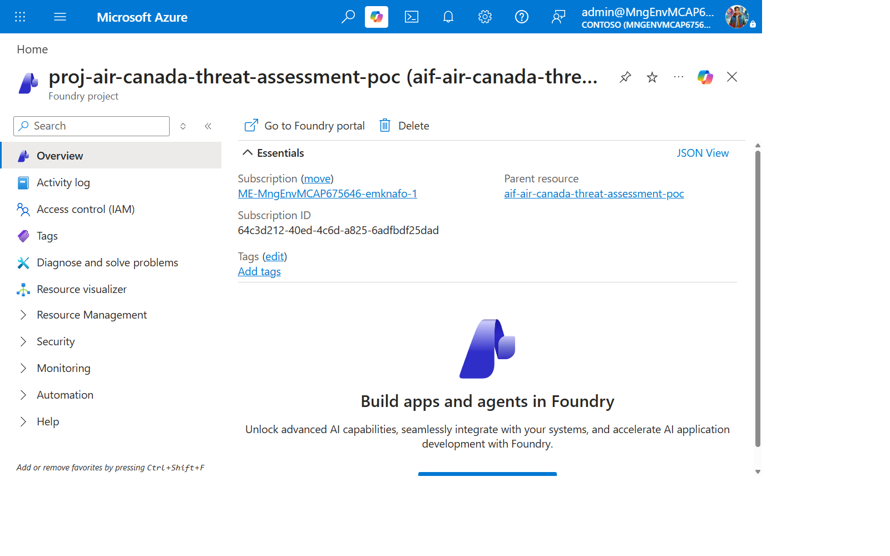
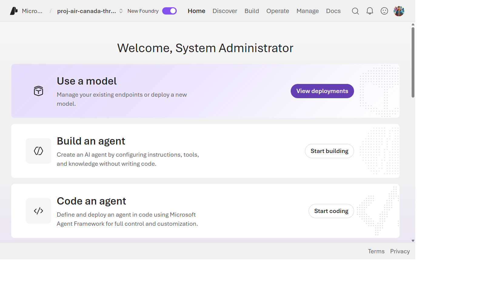
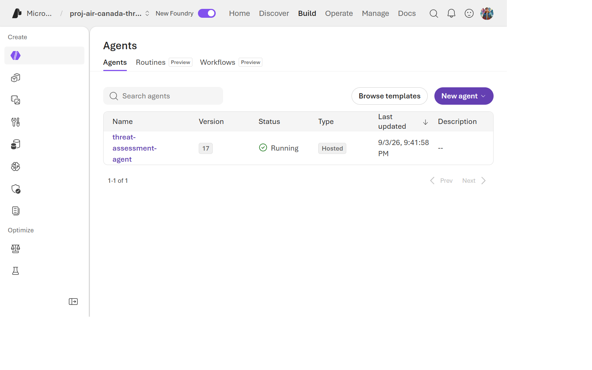
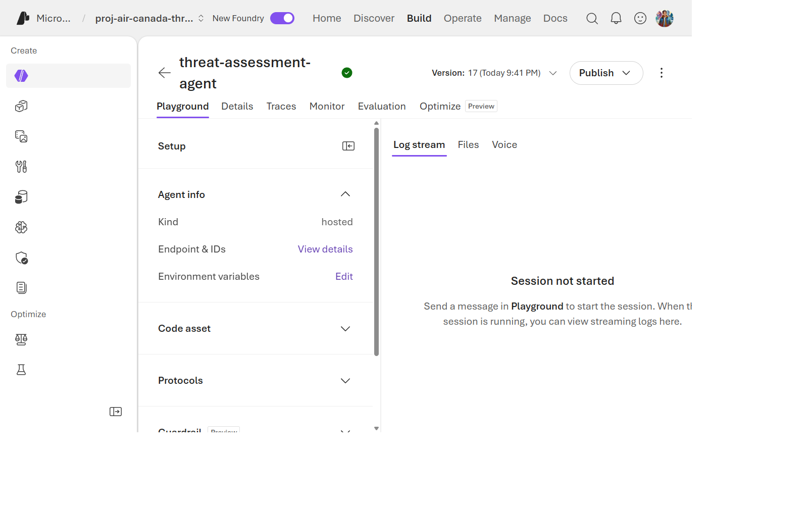

> 🇬🇧 **[English version](../../labs/lab-03-deploy-agent)**

## Aperçu

| Élément | Valeur |
| --- | --- |
| **Durée** | 35 minutes |
| **Niveau** | Intermédiaire |
| **Prérequis** | [Lab 02](lab-02-mcp-servers.md) |

## Objectifs d'apprentissage

À la fin de ce lab, vous serez capable de :

* Lire un manifeste `azure.yaml` qui mélange des services d'infrastructure et un service d'agent hébergé
* Provisionner un projet Foundry, un déploiement de modèle et des connexions MCP avec `azd provision`
* Déployer le code de l'agent hébergé avec `azd deploy`
* Localiser l'agent déployé, son modèle et son identité dans le portail Foundry

## Exercices

### Exercice 3.1 : Lire la définition du service agent

Ouvrez `azure.yaml` à la racine du dépôt. Le service
`threat-assessment-agent` est celui qui nous intéresse :

```yaml
threat-assessment-agent:
    project: ./src/threat-assessment-agent
    host: azure.ai.agent
    language: python
    uses:
        - ai-project
        - security-tools
    codeConfiguration:
        dependencyResolution: remote_build
        entryPoint: main.py
        runtime: python_3_13
    container:
        resources:
            cpu: "0.5"
            memory: 1Gi
    kind: hosted
    protocols:
        - protocol: responses
          version: 2.0.0
```

Champs clés :

| Champ | Signification |
| --- | --- |
| `host: azure.ai.agent` | Ceci est un service d'agent hébergé Foundry, pas une container app ni une fonction |
| `kind: hosted` | Foundry exploite le calcul de session ; vous ne possédez que le code du graphe |
| `uses: [ai-project, security-tools]` | Câble le déploiement de modèle et la Toolbox MCP du Lab 01 |
| `dependencyResolution: remote_build` | Foundry construit vos dépendances Python côté serveur à partir de `requirements.txt` |
| `protocol: responses` | L'agent parle le protocole Responses compatible OpenAI (supporte le streaming) |

### Exercice 3.2 : Provisionner

Continuez dans la même session PowerShell et le même dépôt qu'au Lab 02.
Ne créez pas un autre environnement et ne sélectionnez pas un environnement
staging/production du formateur. Vérifiez le groupe et les paramètres MCP
avant d'approuver l'aperçu.

Le réseau du Lab 02 doit déjà exister. Le contrôle ci-dessous vérifie les
sous-réseaux, délégations, le lien DNS Cosmos et les paramètres réseau existants.
S'il exige une migration, arrêtez : ajouter l'injection réseau Foundry ou changer
le réseau d'un environnement Container Apps existant n'est pas une mise à jour
ordinaire. Ne supprimez pas de ressources pour forcer la réussite de l'exercice.

```powershell
azd env select $WorkshopEnv
if ((azd env get-value AZURE_RESOURCE_GROUP) -ne $ResourceGroup) { throw 'Wrong resource group' }
azd env get-value MCP_NAME_PREFIX
azd env get-value MCP_ACR_NAME
azd env get-value DEFENDER_MCP_IMAGE
azd env get-value ANOMALY_MCP_IMAGE
./scripts/test-network-readiness.ps1 -ResourceGroup $ResourceGroup -EnvironmentName $WorkshopEnv `
    -Location $Location -VnetName $VnetName -McpNamePrefix $McpPrefix
azd provision --preview
azd provision
```

Cette étape crée (ou confirme) le compte Foundry, le projet, le déploiement
`gpt-4o-mini` et deux connexions de projet (`defender-conn`, `anomaly-conn`).
L'étape suivante déploie la Toolbox `security-tools` et le code de l'agent.
L'environnement apprenant démarre à 10k jetons/minute, et non à la capacité
supérieure de staging. La disponibilité régionale et le quota peuvent varier ;
en cas de quota insuffisant, arrêtez et contactez votre administrateur.

Foundry reste accessible publiquement aux clients authentifiés, tandis que les
sorties de l'agent utilisent son sous-réseau dédié. Le stockage des checkpoints
Cosmos reste facultatif : cette étape ne le crée ni ne l'active. L'accès public à
Foundry ne contourne pas le pare-feu Cosmos. Consultez [Réseau Cosmos privé](../private-networking.md)
avant cette expérience. Les builds distants du code nécessitent aussi les points
de terminaison sortants documentés ; ne bloquez pas toutes les sorties du sous-réseau.

Si la CLI est interrompue, consultez d'abord **Déploiements** dans votre nouveau
groupe de ressources. Si le déploiement ARM a réussi, récupérez les sorties
avec `azd env refresh` au lieu de recréer les ressources. S'il a échoué,
consultez son erreur. Un avertissement du catalogue de modèles ne suffit pas
à conclure à un échec : vérifiez que le déploiement réel `gpt-4o-mini` affiche
`Succeeded` dans votre compte Foundry.

### Exercice 3.3 : Déployer l'agent

```powershell
azd env set APP_VERSION "0.0.0-dev"
azd deploy
```

Cette étape téléverse `src/threat-assessment-agent/` et le construit à
distance selon `dependencyResolution: remote_build`. Notez la version retournée ;
un code inchangé peut réutiliser une version. Un déploiement réussi ne prouve
pas encore que l'agent peut appeler son modèle ou sa Toolbox.

Accordez à l'identité d'instance les deux rôles requis avec le script existant.
Il déduit le compte de cet environnement et n'ajoute que les rôles manquants :
**Foundry User** et **Cognitive Services OpenAI User**. Votre identité opérateur
doit pouvoir attribuer des rôles sur ce compte ; ne vous accordez pas de droits
à l'échelle de l'abonnement pour contourner un refus.

```powershell
bash scripts/configure-agent-rbac.sh threat-assessment-agent
```

Sous Windows, utilisez la configuration Git Bash du Lab 00. Vous pouvez
relancer ce script après un redéploiement qui change l'identité d'instance.
La propagation des rôles peut prendre quelques minutes ; validez une vraie
réponse au Lab 04 avant de continuer.

> **Dépannage : `no Foundry project endpoint resolved`**
>
> Si `azd deploy` échoue sur le service `security-tools` ou
> `threat-assessment-agent` avec cette erreur, votre environnement a été
> provisionné avant l'ajout du point de terminaison du projet Foundry comme
> sortie bicep. Relancez `azd provision` pour le récupérer, ou définissez-le
> manuellement pour cet environnement :
>
> ```powershell
> azd env set FOUNDRY_PROJECT_ENDPOINT "https://<accountName>.services.ai.azure.com/api/projects/<projectName>"
> ```
>
> `<accountName>` et `<projectName>` sont les valeurs `accountName`/`projectName`
> déjà présentes dans votre fichier `.azure/<env>/.env`.

<!-- Cas de dépannage distincts. -->

> **Dépannage : `failed to resolve connection "defender-conn"` (ou `anomaly-conn`)**
>
> Cela signifie que la connexion n'existe pas encore sur le projet Foundry.
> Les connexions Toolbox `defender-conn`/`anomaly-conn` sont créées par
> `azd provision` depuis le bicep (pas par `azd deploy`) ; si votre
> environnement a été provisionné avant l'ajout de ces connexions comme
> ressources bicep, elles n'ont jamais été créées. Relancez
> `azd provision` pour les créer, puis relancez `azd deploy`.

<!-- Cas de dépannage distincts. -->

> **Dépannage : `AZURE_AI_PROJECT_ID is not set`**
>
> Le service `threat-assessment-agent` a besoin de l'ID de ressource ARM
> du projet Foundry (différent de `FOUNDRY_PROJECT_ENDPOINT`). Si votre
> environnement a été provisionné avant l'ajout de cette sortie bicep,
> relancez `azd provision` pour la récupérer, ou définissez-la manuellement :
>
> ```powershell
> azd env set AZURE_AI_PROJECT_ID "/subscriptions/<subscriptionId>/resourceGroups/<resourceGroup>/providers/Microsoft.CognitiveServices/accounts/<accountName>/projects/<projectName>"
> ```

### Exercice 3.4 : Trouver l'agent dans le portail









Naviguez vers votre projet Foundry dans le portail et confirmez que vous
pouvez voir :

1. Le `threat-assessment-agent` dans la liste des agents, avec un numéro
   de version.
2. La page de détail de l'agent, montrant son modèle (`gpt-4o-mini`) et sa
   Toolbox (`security-tools`).
3. **Une identité Entra ID dédiée** a été créée automatiquement pour cet
   agent au moment du déploiement — vous n'avez pas câblé manuellement une
   identité managée. Trouvez-la sous l'onglet **Identity** de l'agent.

> [!TIP]
> Cette « Instance Identity » créée automatiquement est celle qui appelle
> réellement Azure OpenAI et la Toolbox MCP à l'exécution. C'est la même
> identité que vous investiguerez avec `az role assignment list` au
> [Lab 07](lab-07-troubleshooting-rbac.md).

## Vérification des connaissances

* Que signifie `remote_build`, et pourquoi cela pourrait-il compter pour une dépendance volumineuse comme `langgraph` ?
* D'où vient l'identité d'exécution de l'agent — l'avez-vous créée vous-même ?
* Nommez les deux connexions Toolbox câblées dans cet agent, et quel spécialiste utilise laquelle.

## Prochaine étape

Passez au [Lab 04 : Invoquer l'agent et lire les traces](lab-04-invoke-agent.md).
