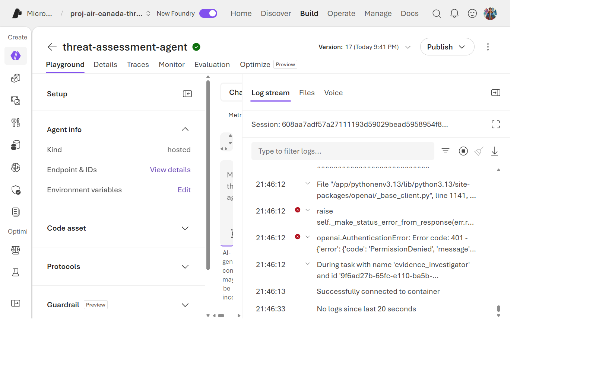
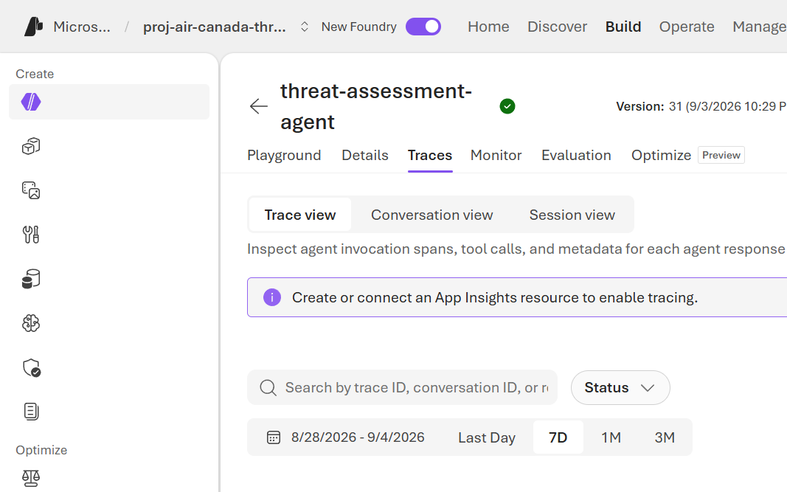

> 🇬🇧 **[English version](../../labs/lab-04-invoke-agent)**

## Aperçu

| | |
|---|---|
| **Durée** | 30 minutes |
| **Niveau** | Intermédiaire |
| **Prérequis** | [Lab 03](lab-03-deploy-agent.md) |

## Objectifs d'apprentissage

À la fin de ce lab, vous serez capable de :

* Invoquer un agent hébergé depuis la CLI et depuis le Foundry Playground
* Lire une trace multi-agent et identifier quel nœud spécialiste a produit quelle partie de la réponse
* Expliquer la différence entre le chemin d'invocation CLI et le chemin du Playground du portail
* Reconnaître une réponse saine par rapport à une réponse dégradée (outil indisponible)

## Exercices

### Exercice 4.1 : Invoquer depuis la CLI

```powershell
azd ai agent show
azd ai agent invoke "Connexion suspecte depuis une IP inconnue 203.0.113.45 ciblant le portail d'administration de la planification des équipages à 02h14 UTC, suivie de trois tentatives MFA échouées et d'une connexion réussie quatre minutes plus tard depuis la même IP."
```

`azd ai agent show` affiche le nom de l'agent, sa version actuelle, son
modèle et son point de terminaison. `invoke` envoie un message via le
protocole Responses et affiche le rapport final.

### Exercice 4.2 : Invoquer depuis le Foundry Playground

Ouvrez l'onglet **Playground** de l'agent dans le portail Foundry et
envoyez le même prompt. Le **flux de journaux** en direct du Playground
affiche la sortie standard du processus Python sous-jacent — utile pour
voir exactement quel nœud spécialiste s'est exécuté et dans quel ordre.



### Exercice 4.3 : Lire la trace

Ouvrez **Application Insights** → **Application Map** ou **Transaction
search** pour le groupe de ressources de l'agent.



Trouvez la trace de votre invocation et identifiez :

1. La décision de répartition du **superviseur** (quel spécialiste s'est exécuté en premier).
2. L'appel d'outil de l'**Enquêteur de preuves** vers `defender-conn`.
3. L'appel d'outil de l'**Analyste de risque** vers `anomaly-conn`.
4. La portée de synthèse finale du **Rédacteur de rapport** — notez qu'elle n'a aucune portée d'appel d'outil sortant, cohérent avec la conception d'isolation des outils du Lab 01.

### Exercice 4.4 : Reconnaître une réponse dégradée

Comparez l'exemple `miss-001` du jeu de données de référence (dans
`eval/golden-dataset.jsonl`) — « la télémétrie Defender est indisponible »
— avec une réponse normale. Une réponse dégradée devrait :

* Ne jamais affirmer que l'hôte est propre lorsque des données manquent.
* Indiquer explicitement l'écart de données dans une section
  **Limitations**.
* Retourner quand même un HTTP 200 / un rapport valide — pas planter la
  requête.

C'est l'indicateur `evidence_tool_unavailable` du
[Lab 01](lab-01-architecture.md) qui apparaît dans le texte réel du
rapport.

## Vérification des connaissances

* Quel est le moyen le plus rapide de voir *quel nœud spécialiste* a traité une requête donnée — la réponse CLI, ou la trace ?
* Que devrait dire un rapport lorsque l'outil de l'Enquêteur de preuves est indisponible, et que ne devrait-il jamais dire ?

## Prochaine étape

Passez au [Lab 05 : Évaluations](lab-05-evaluations.md).
