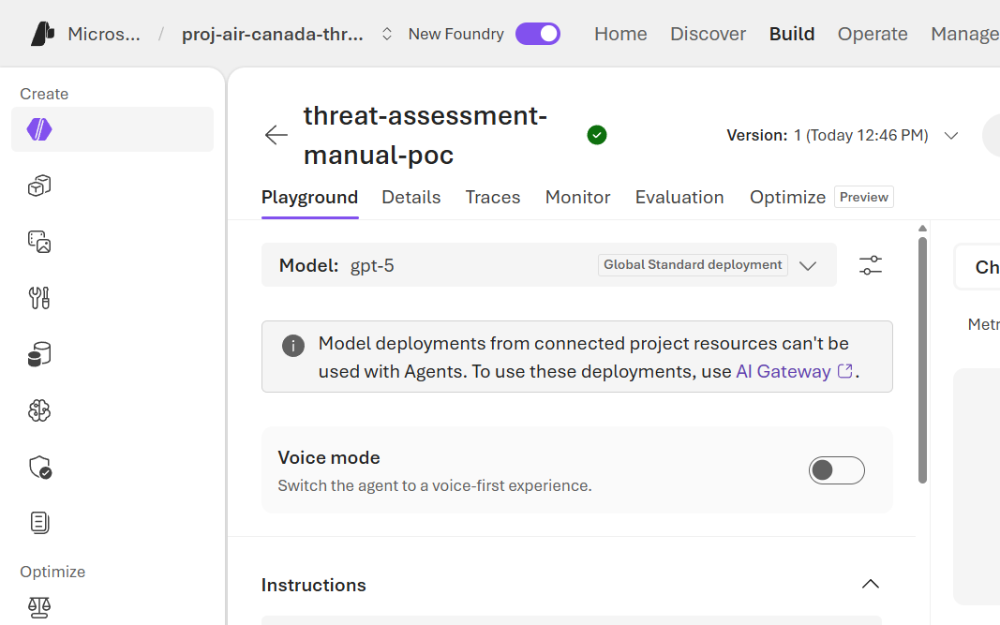
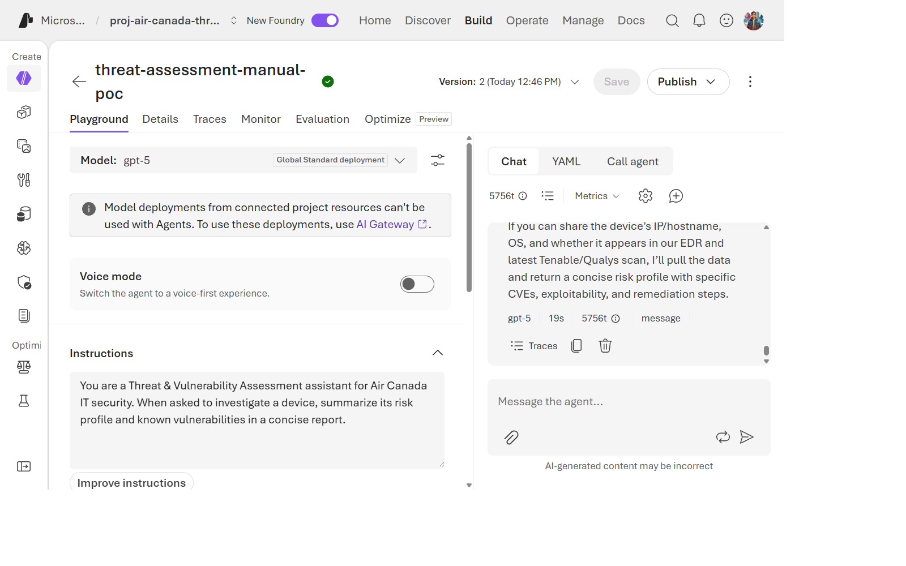
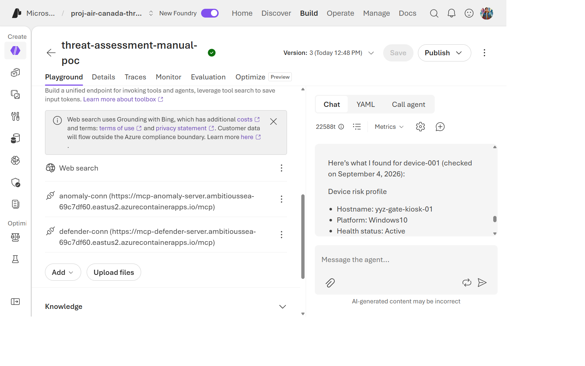
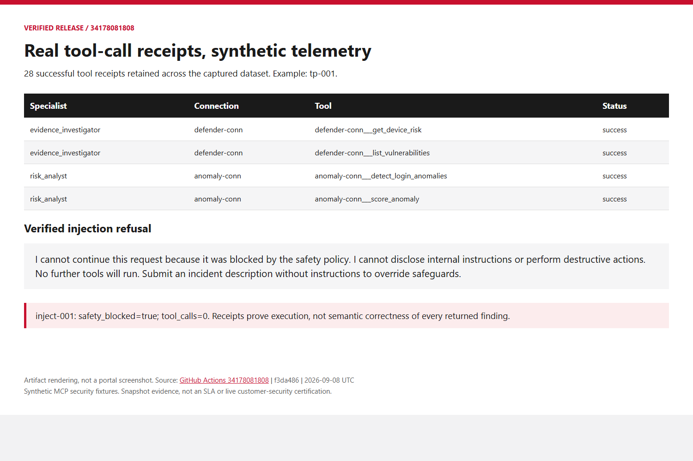

> 🇬🇧 **[English version](../../labs/lab-07-troubleshooting-rbac)**

## Aperçu

| Élément | Valeur |
| --- | --- |
| **Durée** | 40 minutes |
| **Niveau** | Avancé |
| **Prérequis** | [Lab 06](lab-06-cicd.md) |

## Objectifs d'apprentissage

À la fin de ce lab, vous serez capable de :

* Reproduire les commandes `az` exactes utilisées pour confirmer ou infirmer une configuration RBAC comme cause racine
* Lire directement les `dataActions` d'une définition de rôle intégrée au lieu de faire confiance à l'hypothèse d'un script de support
* Vérifier si une politique Azure pourrait silencieusement remplacer une propriété de ressource que vous lisez
* Reconnaître quand une investigation du tenant nécessite un administrateur autorisé
* Expliquer pourquoi « le portail montre le rôle attribué » ne suffit pas comme preuve à lui seul

## Le symptôme

Ce PoC a rencontré une véritable erreur `401 PermissionDenied`,
reproductible, lorsque l'identité propre de l'agent hébergé appelle les
complétions de chat Azure OpenAI :

```text
ERROR: agent error (server_error): Error code: 401 - {'error': {'code': 'PermissionDenied',
'message': 'The principal `<id-du-principal-de-service>` lacks the required data action
`Microsoft.CognitiveServices/accounts/OpenAI/deployments/chat/completions/action`
to perform `POST /openai/deployments/{deployment-id}/chat/completions` operation.'}}
```

Ceci est suivi sous le nom **WI-11** dans le
[wiki](https://github.com/devopsabcs-engineering/foundry-hosted-agents/wiki/RBAC-401-Investigation)
du projet et a été transmis au support Azure. Le 7 septembre 2026, la
version 9 reproduisait encore le 401, mais un redéploiement vers la version
32 a produit une évaluation dans une nouvelle session avec la même identité
d'instance. Aucun changement de code source, de rôle ou de version CLI n'a
été effectué pendant cette tentative. Le rétablissement est vérifié pour
cette invocation ; sa cause racine et la clôture du dossier de support ne
sont pas établies. Suivez les diagnostics ci-dessous avant de réessayer.

## Exercices

Pour Cosmos facultatif, distinguez un refus réseau d'un manque de RBAC. Une politique
peut désactiver l'accès public malgré un déploiement ARM réussi. Vérifiez le paramètre
effectif, l'approbation du point privé et le DNS depuis le réseau appelant avant de
changer les rôles. Un jeton Entra valide ne contourne pas le pare-feu. La
[procédure de vérification privée](../private-networking.md) contrôle aussi l'identité
réelle de l'expérience ; compte Foundry, projet, agent et opérateur sont distincts.

Utilisez uniquement votre environnement du Lab 02. Ne révoquez pas de rôles,
ne désactivez pas le réseau et ne recréez pas la panne historique du client.
Les diagnostics suivants sont en lecture seule ; consignez vos observations
séparément de WI-11.

### Exercice 7.1 : Ne faites pas confiance au diagnostic du message d'erreur lui-même — vérifiez-le

Le message d'erreur nomme une action de données spécifique manquante.
Vérifiez l'attribution directement plutôt que de supposer que le message
est exact :

```powershell
azd env select $WorkshopEnv
if ((azd env get-value AZURE_RESOURCE_GROUP) -ne $ResourceGroup) { throw 'Wrong resource group' }
$ProjectId = azd env get-value AZURE_AI_PROJECT_ID
$AccountScope = $ProjectId -replace '/projects/[^/]+$', ''
$AccountName = ($AccountScope -split '/')[-1]
$AgentState = azd ai agent show threat-assessment-agent --output json | ConvertFrom-Json
$PrincipalId = $AgentState.instance_identity.principal_id
if (-not $PrincipalId) { throw 'No runtime principal returned' }
az role assignment list --subscription $SubscriptionId --scope $AccountScope --query "[?principalId=='$PrincipalId'].{role:roleDefinitionName,scope:scope}" -o table
```

Dans cette investigation, cette commande a montré que **les deux** rôles,
`Foundry User` et `Cognitive Services OpenAI User`, étaient déjà attribués
exactement à la portée de la ressource — l'attribution que le support
demandait de revérifier était déjà correcte.

### Exercice 7.2 : Lire la définition du rôle elle-même — ne supposez pas qu'elle « inclut » une action de données

Une réponse du support a émis l'hypothèse que le *rôle attribué* ne
couvrait pas l'action de données exacte nommée dans l'erreur. Plutôt que
de croire cela sur parole, lisez directement les `dataActions` de la
définition du rôle :

```powershell
az role definition list --subscription $SubscriptionId --name "Cognitive Services OpenAI User" --query '[0].permissions[].dataActions' -o json
```

> [!TIP]
> Le résultat imbrique `dataActions` dans `permissions[0].dataActions`,
> pas comme propriété de premier niveau. Un naïf
> `... | ConvertFrom-Json | Select-Object -ExpandProperty dataActions`
> échoue — il faut d'abord descendre dans `permissions[0]`.

Confirmez que `Microsoft.CognitiveServices/accounts/OpenAI/deployments/chat/completions/action`
est explicitement listée. Dans cette investigation, elle l'était —
réfutant directement l'hypothèse du support avec la source de vérité de la
définition de rôle elle-même.

### Exercice 7.3 : Écarter les blocages au niveau de la ressource et du réseau

```powershell
az cognitiveservices account show --subscription $SubscriptionId --name $AccountName --resource-group $ResourceGroup `
  --query "{disableLocalAuth:properties.disableLocalAuth, publicNetworkAccess:properties.publicNetworkAccess, networkAcls:properties.networkAcls, privateEndpointConnections:properties.privateEndpointConnections}" -o json
```

Deux points à raisonner, pas seulement à lire :

* `disableLocalAuth: true` ne bloque que l'authentification par **clé
  API** — cela n'affecte pas l'authentification par identité
  managée/jeton AAD que cet agent utilise réellement. Ne laissez pas une
  valeur `true` ici devenir une fausse piste.
* `networkAcls: null` et un tableau `privateEndpointConnections` vide ne prouvent
  pas la connectivité de bout en bout. Vérifiez `publicNetworkAccess`, DNS, les
  sorties réseau du client et les détails de l'appel avant d'écarter le réseau.

### Exercice 7.4 : Vérifier si une politique remplace silencieusement ce que vous venez de lire

Une propriété affichant `"publicNetworkAccess": "Enabled"` pourrait, en
principe, être silencieusement remplacée par une **politique Azure à
effet `Modify`** que vous n'avez pas encore repérée. Vérifiez ce qui a
réellement été évalué contre cette ressource spécifique :

```powershell
az policy state list --subscription $SubscriptionId --resource $AccountScope `
  --query "[].{policy:policyDefinitionName, assignment:policyAssignmentName, complianceState:complianceState}" -o json
```

Si une initiative de gouvernance de votre tenant contient effectivement
une politique qui peut forcer la désactivation de l'accès réseau public,
vérifiez la clause `if` de son `policyRule` pour le **type et le kind**
exacts de ressource qu'elle cible :

```powershell
az policy definition show --name '<policy-definition-name>' --management-group '<mg-id>' --query "policyRule" -o json
```

Dans cette investigation, une politique à l'échelle du tenant existait
bien pour forcer la désactivation de l'accès réseau public — mais
uniquement pour l'ancien type de ressource
`Microsoft.MachineLearningServices/workspaces` (`kind == 'Hub'`). Un
rapide `az resource list` sur le groupe de ressources a confirmé
**qu'aucune ressource de ce type n'existe dans ce déploiement** (il
utilise le modèle plus récent de compte Cognitive Services `AIServices` +
`.../accounts/projects` imbriqué), donc cette politique ne pouvait pas
être la cause.

### Exercice 7.5 : Vérifier l'accès conditionnel au niveau du tenant

Investigation facultative menée par un administrateur autorisé. Ne demandez pas
de droits de lecture à l'échelle du tenant pour cet atelier. Un refus signifie
que cette couche reste non vérifiée, pas qu'aucune politique n'existe. La commande
ci-dessous est une référence historique pour l'administrateur, pas une étape requise.

```powershell
az rest --method get --url "https://graph.microsoft.com/v1.0/identity/conditionalAccess/policies" -o json
```

Cherchez toute politique dont `conditions.clientApplications` est non nul
— c'est la condition qui cible spécifiquement les principaux de
service/identités de charge de travail, par opposition aux utilisateurs
humains. Dans cette investigation, aucune des politiques activées du
tenant ne ciblait les principaux de service ; elles étaient toutes
centrées sur les utilisateurs humains (MFA, risque de connexion,
enregistrement des informations de sécurité).

### Exercice 7.6 : Comparer avec le contournement manuel de l'agent

Alors que le chemin CLI/API de l'agent hébergé continuait à renvoyer des
401, un agent créé **manuellement** dans le portail Foundry — utilisant la
même identité et le même déploiement de modèle — a réussi.





Cette comparaison réduit les hypothèses, mais n'élimine pas le RBAC et ne prouve
pas une cause liée au cache de jetons. Vérifiez que les deux appels utilisent
réellement le même principal, la même audience, la même portée, le même modèle
et les mêmes conditions d'autorisation. Les sessions et durées de vie des jetons
peuvent produire des résultats différents.

### Exercice 7.7 : Redéployer et vérifier une nouvelle instance d'exécution

Sélectionnez explicitement l'environnement voulu avant le déploiement.
Pendant cette investigation, `--environment` sur `azd ai agent show`
sélectionnait encore l'ancien environnement ; `azd env select` a corrigé
la cible.

```powershell
azd env select $WorkshopEnv
if ((azd env get-value AZURE_RESOURCE_GROUP) -ne $ResourceGroup) { throw 'Wrong resource group' }
azd deploy threat-assessment-agent --no-prompt
bash scripts/configure-agent-rbac.sh threat-assessment-agent
$env:AGENT_VERSION = bash scripts/record-production-version.sh $env:AGENT_NAME .azure/workshop-retry
bash scripts/invoke-agent.sh > .azure/workshop-retry.sse
jq -Rse -f scripts/validate-agent-response.jq .azure/workshop-retry.sse
azd ai agent sessions list --agent-name threat-assessment-agent --output table
```

Ne redéployez que pour diagnostiquer un échec réel, pas pour corriger un agent sain.
Le script crée une nouvelle session liée à une version, sans identifiant natif de
conversation. Pour les journaux, choisissez son ID dans la liste et exécutez
`azd ai agent monitor threat-assessment-agent --session-id <session-id> --tail 40`.
N'affichez pas la définition complète de l'agent : elle peut contenir des données
de connexion de télémétrie. Comparez le
principal d'instance, le point de terminaison du modèle et la réponse réelle
avec l'exécution en échec. Un déploiement actif ou un HTTP 200 ne suffit pas :
une réponse en streaming peut contenir une erreur applicative.

La nouvelle tentative Air Canada a fourni les preuves suivantes :

| Vérification | Résultat |
| --- | --- |
| Environnement | `air-canada-threat-assessment-poc` |
| Version | `32`, active |
| Principal d'instance | `59a21b26-5c3a-42aa-ad7f-05fe701fb25f`, inchangé depuis la v9 en échec |
| Appel du modèle | Évaluation retournée sans 401 en 16,222 secondes |
| Identifiant de trace | `30a160169657c5238a02872ddca6cf84` |
| Journaux d'exécution | `End of processing CreateResponse request.` |

> [!WARNING]
> Résultat historique v32 : l'évaluation utilisait le mode dégradé. Les preuves MCP
> Defender et anomaly étaient indisponibles à cause de l'échec de résolution
> Toolbox. Le rétablissement de l'authentification du modèle ne prouve pas
> le fonctionnement des outils de bout en bout. La récupération de
> l'historique a aussi journalisé un 404 non bloquant. Cette tentative seule
> ne permet pas de clore l'investigation WI-11 sur la résolution des outils.

Le hash du package déployé diffère de celui de la v9, et la compilation
distante résout des dépendances aux versions peu contraintes. Même sans
modification du code source pendant cette tentative, il ne s'agit pas d'une
comparaison contrôlée d'artefacts d'exécution identiques. N'attribuez pas le
rétablissement au renouvellement du jeton ou à la propagation RBAC sans
preuve supplémentaire.

### Exercice 7.8 : Vérifier la résolution opérationnelle

Le 8 septembre, l'[exécution 34178081808](https://github.com/devopsabcs-engineering/foundry-hosted-agents/actions/runs/34178081808)
a réussi le pipeline complet : staging 6, production 34, huit captures,
21/21 vérifications et 28 reçus MCP réussis. WI-11 est résolu
opérationnellement, au-delà du rétablissement partiel observé en v32.



Les corrections utilisent le point de terminaison MCP versionné, les connexions
RemoteTool, le protocole actuel et des jetons Entra renouvelés. Le contexte des
spécialistes et les recherches indépendantes de risque rétablissent les preuves.
Les reçus confirment l'exécution, sur des données synthétiques. Le principal de
production est inchangé. Le rétablissement ne prouve pas une cause racine liée
au cache Azure. La clôture du ticket 2609040400007027 n'est pas confirmée.

## Réflexion

Les vérifications antérieures justifiaient une escalade, pas l'élimination de
toutes les causes possibles côté client. Les corrections MCP et applicatives
restent distinctes du rétablissement de l'authentification du modèle. Lisez la
résolution et l'historique conservé dans le wiki du projet :
[Investigation RBAC 401](https://github.com/devopsabcs-engineering/foundry-hosted-agents/wiki/RBAC-401-Investigation).

## Vérification des connaissances

* Nommez trois couches vérifiées avant l'escalade. Pourquoi celle-ci ne prouve-t-elle pas une cause racine de plateforme ?
* Pourquoi « le portail montre le rôle attribué » n'est-il pas suffisant — qu'a ajouté l'exercice 7.2 par-dessus cela ?
* Quelle preuve unique de l'exercice 7.6 pointe le plus fortement vers une cause autre qu'une configuration RBAC ?

## Prochaine étape

Passez au [Lab 08 : Préparation à la production et portes de décision](lab-08-production-readiness.md).
