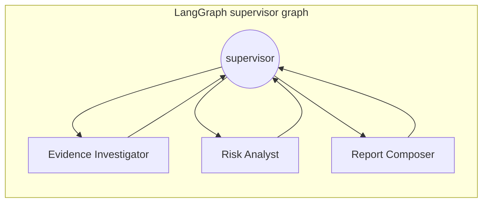
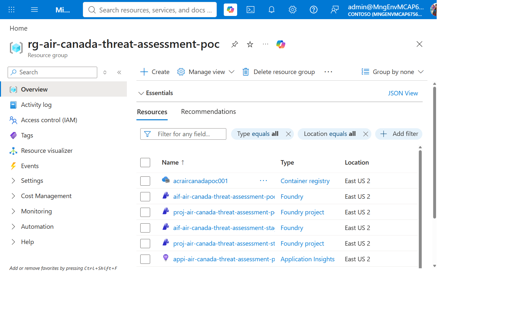
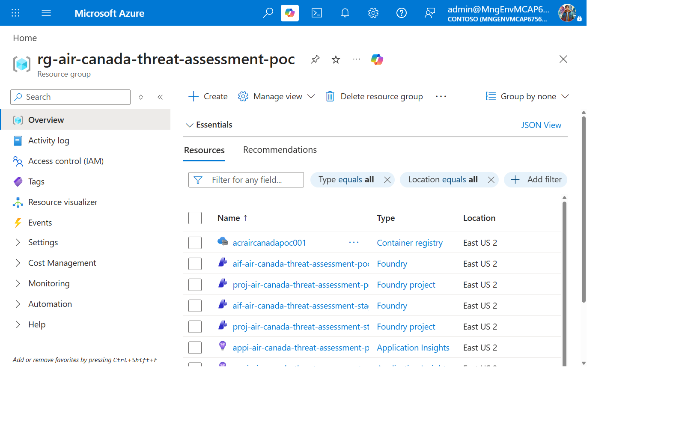

## Overview

| | |
|---|---|
| **Duration** | 30 minutes |
| **Level** | Beginner |
| **Prerequisites** | [Lab 00](lab-00-setup.md) |

## Learning Objectives

By the end of this lab, you will be able to:

* Explain the LangGraph supervisor/specialist pattern used by this agent
* Identify the four architectural layers involved in giving an agent tools (implementation, hosting, registration, consumption)
* Read `azure.yaml` and map every block to a deployed Azure resource
* Explain why MCP tool servers are deployed independently of the agent

## Exercises

### Exercise 1.1: The Supervisor/Specialist Graph

Open [`src/threat-assessment-agent/graph.py`](https://github.com/devopsabcs-engineering/foundry-hosted-agents/blob/main/src/threat-assessment-agent/graph.py).

A **supervisor** node routes to three **specialist** nodes and only allows
the graph to proceed to reporting once both evidence and risk analysis are
complete:

| Node | Role | Tool access |
|---|---|---|
| Evidence Investigator | Gathers device/vulnerability context | `defender-conn` only |
| Risk Analyst | Scores anomalies and login patterns | `anomaly-conn` only |
| Report Composer | Synthesizes the final report | None — read-only synthesis |

This tool isolation by role is deliberate: no single node can call every
tool, and the Report Composer — the node that produces the customer-facing
output — can't call *any* tool. Find the `EVIDENCE_INVESTIGATOR_PROMPT`,
`RISK_ANALYST_PROMPT`, and `REPORT_COMPOSER_PROMPT` constants in `graph.py`
and note how each prompt only describes the tools that node is allowed to
use.

### Exercise 1.2: Graceful Tool-Resolution Degradation

Open [`src/threat-assessment-agent/state.py`](https://github.com/devopsabcs-engineering/foundry-hosted-agents/blob/main/src/threat-assessment-agent/state.py)
and find the `evidence_tool_unavailable` / `risk_tool_unavailable` flags.

`main.py` wraps Foundry's tool-resolution step so that a known platform-side
gap degrades to an honestly-labeled plain-LLM analysis instead of crashing
the request. This is a real production-readiness pattern: when a dependency
your graph relies on isn't available, fail *visibly and honestly* inside
the output, not silently or with a hard crash.

### Exercise 1.3: The Four Tool Layers

MCP tools are not "part of the agent" — they pass through four distinct
layers. Read `azure.yaml` at the repository root and match each block to a
layer:

| Layer | What it does | `azure.yaml` block |
|---|---|---|
| 1. Implementation | The actual MCP server code (Defender tools, anomaly tools) | `mcp/defender-server/`, `mcp/anomaly-server/` (not in `azure.yaml` — separate `azd` services, see Lab 02) |
| 2. Hosting | Independent Azure runtime with its own auth, networking, health checks | Deployed as Azure Container Apps |
| 3. Registration | Defines endpoint + credential policy per MCP server | `anomaly-conn` / `defender-conn` (`host: azure.ai.connection`) |
| 4. Consumption | Aggregates registered tools for reuse across agents | `security-tools` (`host: azure.ai.toolbox`) |

> [!IMPORTANT]
> The Foundry Toolbox is the **registration/aggregation layer**, not the
> hosting runtime for your MCP server code. Your MCP servers still need
> somewhere to run — in this PoC, that's Azure Container Apps.

### Exercise 1.4: Match Resources to the Portal

Open the Azure Portal resource group for this workshop and find the
resources below. Compare against the screenshot.

| Resource | Type | `azure.yaml` service |
|---|---|---|
| `aif-*` | Cognitive Services account (kind `AIServices`) | `ai-project` |
| `aif-*/proj-*` | Foundry project (nested resource) | (implicit — the project the agent deploys into) |
| `mcp-defender-server` | Container App | `mcp/defender-server` |
| `mcp-anomaly-server` | Container App | `mcp/anomaly-server` |
| `acr*` | Container Registry | (backs the Container Apps' images) |

## Knowledge Check

* Why does the Report Composer node have zero tool access?
* Name the four tool layers in order, from "your code" to "the LLM calling it."
* What does `main.py`'s degradation behavior return when tool resolution fails, and why is that better than crashing?

## Next Steps

Continue to [Lab 02: Deploy the MCP Tool Servers](lab-02-mcp-servers.md).
