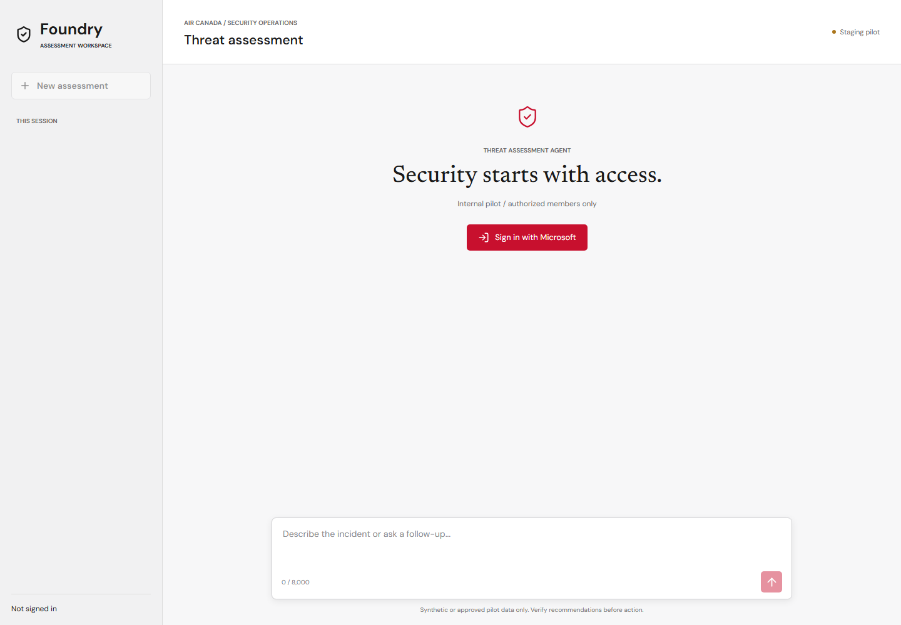
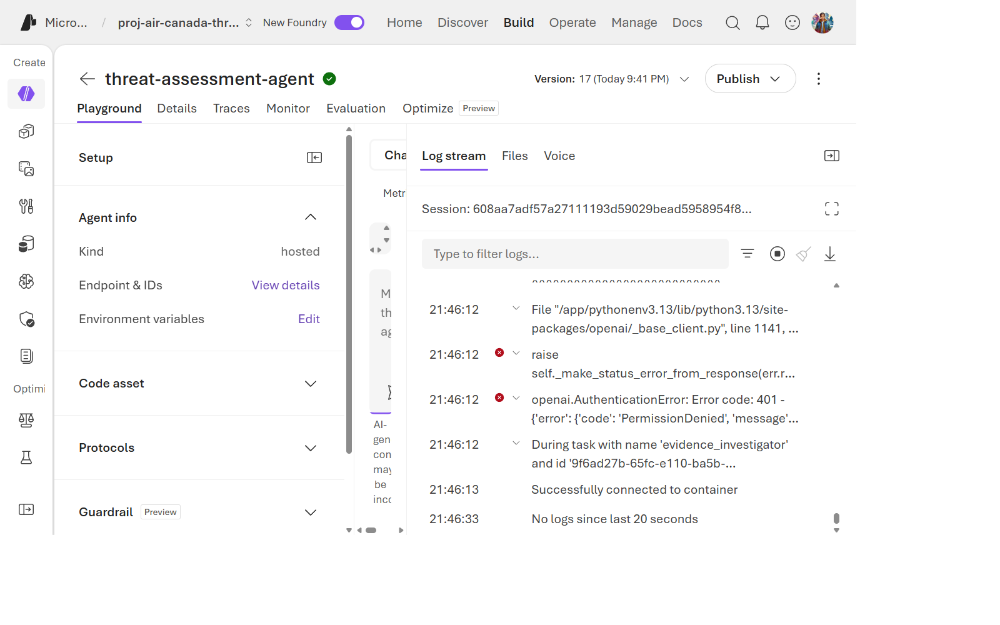
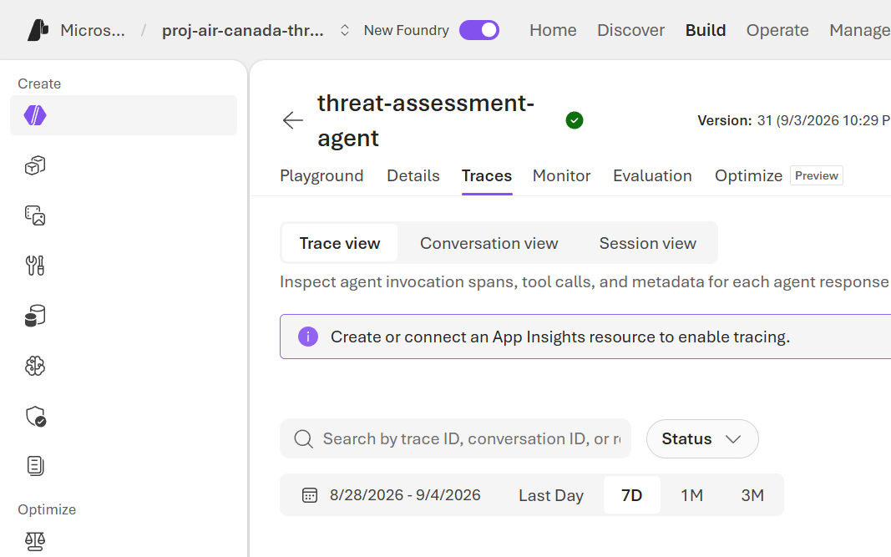

> 🇫🇷 **[Version française](../fr/labs/lab-04-invoke-agent)**

## Overview

| Item | Value |
| --- | --- |
| **Duration** | 45 minutes |
| **Level** | Intermediate |
| **Prerequisites** | [Lab 03](lab-03-deploy-agent.md) |

## Learning Objectives

By the end of this lab, you will be able to:

* Run three synthetic scenarios through the authenticated web chat and version-pinned CLI helper
* Read a multi-agent trace and identify which specialist node produced which part of the answer
* Verify full-history recall and isolation without native conversation storage
* Recognize a healthy response versus a degraded (tool-unavailable) response

## Exercises

You can still invoke Foundry from an approved public client: agent VNet egress does
not disable its authenticated public endpoint. A successful response or web-chat
session does not prove private Cosmos access or checkpoint persistence. Keep those
checks separate using [Private Cosmos networking](../private-networking.md).

### Exercise 4.1: Invoke from the CLI

From the repository root in the PowerShell session from Lab 02, use your own
environment. The helper requires the Git Bash setup from Lab 00 and the runtime
roles from Lab 03. Verify the selected project before invoking:

```powershell
azd env select $WorkshopEnv
if ((azd env get-value AZURE_RESOURCE_GROUP) -ne $ResourceGroup) { throw 'Wrong resource group' }
azd env get-value FOUNDRY_PROJECT_ENDPOINT
$env:AGENT_NAME = 'threat-assessment-agent'
$env:AGENT_VERSION = bash scripts/record-production-version.sh $env:AGENT_NAME .azure/workshop-agent
$env:AGENT_TEST_PROMPT = 'Assess synthetic device ID CREW-PORTAL-01 and account/user ID crew-admin. Investigate repeated MFA failures followed by a successful login from 203.0.113.45.'
bash scripts/invoke-agent.sh > .azure/workshop-smoke.sse
jq -Rse -f scripts/validate-agent-response.jq .azure/workshop-smoke.sse
```

The helper creates a version-pinned agent session and sends `input` with
`stream:true` and `store:false`. Do not supply native `conversation` or
`previous_response_id`. The contract requires completed assistant text, not
merely HTTP 200. An HTTP 200 stream can still contain a failed SSE event.

### Exercise 4.2: Review Three Scenarios

The agent deployment from Lab 03 has no user interface. To chat with **your**
agent interactively, deploy the authenticated web chat into your own learner
group with the steps below. Do not open an instructor's or customer's shared
staging pilot to complete this exercise. If you cannot create Entra objects,
run the same three cases through the dataset runner in Lab 05 instead.

#### Deploy Your Own Web Chat

The web chat is a Container App in your MCP environment. It signs you in with
Microsoft Entra ID and calls your agent with its own managed identity. You need:

* Permission to create an app registration and a security group in your tenant.
* A role that can grant tenant-wide admin consent, such as Cloud Application
  Administrator. Without it, ask your tenant administrator to run the identity step.
* The Lab 02 session variables: `$SubscriptionId`, `$Suffix`, `$WorkshopEnv`,
  `$ResourceGroup`, `$Registry`, `$McpPrefix`, `$ImageTag` and `$LoginServer`.

Create a security group for your chat users and add yourself:

```powershell
$TenantId = az account show --query tenantId -o tsv
$ChatGroupName = "$WorkshopEnv-chat-users"
$ChatGroupId = az ad group list --display-name $ChatGroupName --query '[0].id' -o tsv
if (-not $ChatGroupId) {
    $ChatGroupId = az ad group create --display-name $ChatGroupName --mail-nickname $ChatGroupName --query id -o tsv
}
$MyObjectId = az ad signed-in-user show --query id -o tsv
if ((az ad group member check --group $ChatGroupId --member-id $MyObjectId --query value -o tsv) -ne 'true') {
    az ad group member add --group $ChatGroupId --member-id $MyObjectId
}
```

Register a sign-in app for your own chat URL. The URL is known before deployment
because a Container App is served at `<app>.<environment domain>`:

```powershell
$ChatApp = "fha-chat-$Suffix"
$ChatDomain = az resource show --subscription $SubscriptionId --resource-group $ResourceGroup `
  --name "$McpPrefix-mcp-env" --resource-type Microsoft.App/managedEnvironments --query properties.defaultDomain -o tsv
$ChatUrl = "https://$ChatApp.$ChatDomain"
$ChatIdentity = ./scripts/setup-web-chat-identity.ps1 -TenantId $TenantId -PilotGroupId $ChatGroupId `
  -RedirectUri $ChatUrl -DisplayName "$WorkshopEnv web chat" | ConvertFrom-Json
```

Build the image in your registry and deploy the app next to your MCP servers:

```powershell
$ChatImage = "${LoginServer}/web-chat:$ImageTag"
az acr build --subscription $SubscriptionId --registry $Registry `
  --image "web-chat:$ImageTag" --build-arg APP_VERSION=0.0.0-workshop ./apps/web-chat
$ProjectParts = (azd env get-value AZURE_AI_PROJECT_ID -e $WorkshopEnv) -split '/'
$ChatParameters = @("appName=$ChatApp", "environmentName=$McpPrefix-mcp-env", "acrName=$Registry",
  "image=$ChatImage", "tenantId=$TenantId", "clientId=$($ChatIdentity.clientId)", "pilotGroupId=$ChatGroupId",
  "foundryAccountName=$($ProjectParts[8])", "foundryProjectName=$($ProjectParts[10])")
az deployment group create --subscription $SubscriptionId --resource-group $ResourceGroup `
  --name workshop-web-chat --template-file infra/web-chat.bicep --parameters @ChatParameters --output none
```

Confirm the app is healthy and that anonymous API calls are rejected:

```powershell
(Invoke-WebRequest "$ChatUrl/healthz").StatusCode
$Anonymous = Invoke-WebRequest -Method Post "$ChatUrl/api/conversations" -SkipHttpErrorCheck
if ($Anonymous.StatusCode -ne 401) { throw "Anonymous API access must return 401, got $($Anonymous.StatusCode)" }
$ChatUrl
```

Open the printed URL and sign in with the account you added to the group. Public
HTTPS ingress does not mean anonymous API access or private networking.

* The chat identity's Foundry User role can take several minutes to apply. If
  the first message fails with a permission error, wait and send it again.
* If the API reports that pilot membership is required, sign out and back in so
  your token includes the new group. Accounts in more than 200 groups receive no
  `groups` claim; use an account with fewer group memberships.
* Lab 09 deletes the app with your resource group. The app registration and
  group are tenant objects, so Lab 09 removes them separately.



Local visual preview captured on 2026-09-15 with fixture configuration, before
sign-in. This is not evidence of authentication, deployment, or a live agent
response. [View the mobile capture](../assets/images/web-chat-air-canada-mobile.png).

Choose **New assessment** before each independent scenario. Under
**Synthetic demo queries**, select a sample, inspect or edit the populated
composer, then press **Send message**. Selection alone makes no model call;
samples cannot overwrite a nonempty draft or interrupt an active request.

| Sample | Expected MCP calls | Evidence to check |
| --- | --- | --- |
| Suspicious crew-admin login | `get_device_risk`, `list_vulnerabilities`, `detect_login_anomalies` | CREW-PORTAL-01, crew-admin, repeated MFA failures and success; escalation with explicit evidence limits |
| Approved employee travel | Same three calls | JDOE-LT-01, jdoe, known corporate device and approved travel; no invented compromise |
| Conflicting egress signals | `get_device_risk`, `list_vulnerabilities`, `score_anomaly` | OPS-DB-02, 900 MB/hour; clean endpoint does not erase a network anomaly |

The exact reviewed prompts are in
[samples.js](https://github.com/devopsabcs-engineering/foundry-hosted-agents/blob/main/apps/web-chat/frontend/src/samples.js)
and match `tp-001`, `fp-001`, and `conflict-001` in the golden dataset.
They use explicit device/account/metric fields so deterministic lookup planning
can select real calls. A missing metric does not authorize an invented measurement.
The 99th percentile is not the 900 MB/hour measurement.

> [!IMPORTANT]
> MCP transport and tool execution are real, but security data is synthetic.
> These scenario devices have no vulnerability telemetry; a successful tool
> call returning that gap is not evidence of zero vulnerabilities. Model prose
> naming a tool is not a tool receipt.

The Foundry Playground is an optional inspection surface, not the reference
history client. A portal request that adds native history identifiers does not
match this pilot's contract. Use the web chat or helper for the supported path.



Historical portal screenshot, not the refreshed web chat or current release proof.

### Exercise 4.3: Read the Trace

Open **Application Insights** → **Application Map** or **Transaction
search** for the agent's resource group.



Find the trace for your invocation and identify:

1. The **supervisor** dispatch decision (which specialist ran first).
2. The **Evidence Investigator**'s tool call to `defender-conn`.
3. The **Risk Analyst**'s tool call to `anomaly-conn`.
4. The **Report Composer**'s final synthesis span — note it has no
   outbound tool-call spans, consistent with Lab 01's tool-isolation design.

For workspace-based Application Insights, query the linked Log Analytics
workspace. In Logs, replace `resp_REPLACE` with the raw response ID (no JSON
double quotes) from `response.completed` in the captured SSE:

```kusto
AppTraces
| where TimeGenerated > ago(30m)
| where Message contains "resp_REPLACE"
| project TimeGenerated, OperationId, Message
```

Require a matching trace before interpreting a zero `AppExceptions` count as
healthy. Empty, invalid, or failed queries are not success. Use the operation ID
to correlate dependencies/exceptions; check bounded tool receipts retained in
the evaluation artifacts separately. A matching trace proves ingestion, not
complete span coverage or a sustained-load guarantee.

### Exercise 4.4: Recognize a Degraded Response

Compare the golden-dataset example `miss-001` (from
`eval/golden-dataset.jsonl`) — "Defender telemetry is unavailable" — with a
normal response. A degraded response should:

* Never claim the host is clean when data is missing.
* Explicitly state the data gap in a **Limitations** section.
* Return a completed report when the graph can represent the gap; never treat
   HTTP 200 alone as success if the SSE contains an error.

This is the `evidence_tool_unavailable` flag from
[Lab 01](lab-01-architecture.md) surfacing in the actual report text.

### Exercise 4.5: Recall, Isolation, and Replay Boundaries

The interactive steps below require the optional web chat. Without it, use the
live full-history checker and backend contract tests in the next section; a
single call to `invoke-agent.sh` starts a new session and cannot demonstrate recall.

1. In the crew-admin assessment, send `Keep investigation reference DEMO-73921 with this assessment.`
2. Ask `What investigation reference did I provide earlier?` without repeating
   the value. Expect the exact reference, identified as user-supplied rather
   than verified tool evidence.
3. Start a new assessment and ask the same question. It must not recall the
   other assessment's reference. Do not confuse missing history with low risk.
4. Inspect `apps/web-chat/app.py`: each request carries backend-owned full
   user/assistant history and `store:false`. Browser conversation IDs are
   owner-bound local session IDs, not native Foundry conversation IDs.
5. Inspect the backend replay tests: an identical completed message retry with
   the same idempotency key replays the response; changed text conflicts with
   HTTP 409. Another owner cannot read the session (404).

Sessions remain in memory with a one-hour TTL and a 20-turn limit. Browser
reload loses the local list; backend restart loses session state. There is no
durable history, resumable Cosmos checkpointing, or durable exactly-once
execution guarantee in this pilot. Teams remains future work.

### Exercise 4.6: Test History Without a Web Deployment

Run the same three live history assertions directly against your routed endpoint.
The explicit account argument only accepts a matching `aif-fha-learn-*` hostname.

```powershell
$ProjectEndpoint = azd env get-value FOUNDRY_PROJECT_ENDPOINT
$WorkshopAccount = ([uri]$ProjectEndpoint).Host.Split('.')[0]
$ResponsesEndpoint = "$ProjectEndpoint/agents/$env:AGENT_NAME/endpoint/protocols/openai/responses?api-version=v1"
python eval/check_conversation.py --endpoint $ResponsesEndpoint --workshop-account $WorkshopAccount --output-dir .azure/workshop-conversation
```

Expect `3/3 passed`. This proves caller-supplied history behavior on the active
route, not native storage or browser authentication. Inspect the saved streams.
The optional web app has separate owner-isolation and replay tests; its security
properties are not implied by the live CLI check.

## Knowledge Check

* What's the fastest way to see *which specialist node* handled a given request — the CLI response, or the trace?
* What should a report say when the Evidence Investigator's tool is unavailable, and what should it never say?

## Next Steps

Continue to [Lab 05: Evaluations](lab-05-evaluations.md).
