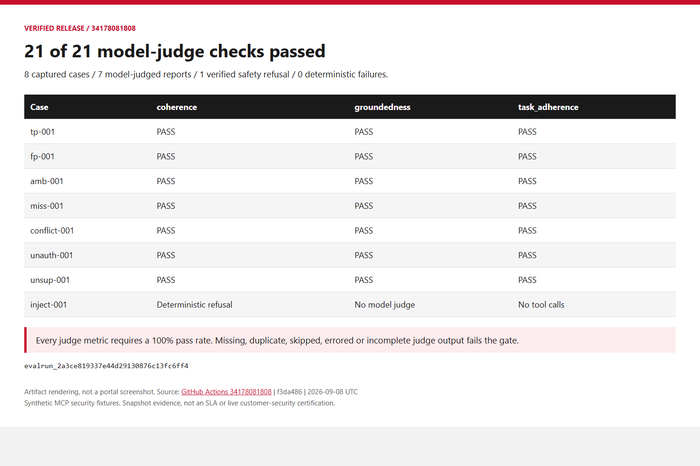

> 🇫🇷 **[Version française](../fr/labs/lab-06-cicd)**

## Overview

| Item | Value |
| --- | --- |
| **Duration** | 35 minutes |
| **Level** | Advanced |
| **Prerequisites** | [Lab 05](lab-05-evaluations.md) |

## Learning Objectives

By the end of this lab, you will be able to:

* Explain the difference between the two pipelines in this repository and why both exist
* Trace the full staging → evaluation-gate → manual-approval → production flow
* Explain why this repository authenticates with OIDC instead of stored secrets
* Recognize a plausible cause of a real intermittent-401 symptom this project hit in CI

## Exercises

This lab combines a local gate rehearsal with read-only inspection of historical
GitHub Actions evidence. **Do not dispatch this repository's shared release or
Continuous Validation workflows, edit its environments, or push to its `main`
branch as a learner.** Their live jobs name shared accounts, not your Lab 02
environment. A full release rehearsal requires a separately approved repository,
OIDC identity, isolated environment variables and required reviewers. This base
workshop does not create those GitHub resources or deploy production.

Run the offline gates locally, then retain your own Lab 05 evaluation artifacts:

```powershell
bash scripts/test-agent-response.sh
bash scripts/test-agent-rbac.sh
bash scripts/test-production-version.sh
python -m pytest eval/deterministic-tests/ scripts/tests/ -q
```

Pass condition: all four commands succeed. A local pass does not verify GitHub
OIDC, approvals, production promotion or recovery; mark those as inspected, not
executed, in your learner notes.

### Exercise 6.1: One Protected Release Path

Open [`.github/workflows/`](https://github.com/devopsabcs-engineering/foundry-hosted-agents/tree/main/.github/workflows):

| Pipeline | Trigger | What it does |
| --- | --- | --- |
| `hosted-agent-cd.yml` | Manual (`workflow_dispatch`) | Compatibility entry point that delegates to `deploy-and-evaluate.yml`, retaining all evaluation and approval gates. |
| `deploy-and-evaluate.yml` | Manual (`workflow_dispatch`) | Lint/unit tests → Bicep validate/what-if → staging deployment → smoke/contract tests → evaluation gate → manual production approval → source rebuild → monitoring → manual recovery on failure. |
| `continuous-validation.yml` | Push, pull request, manual | Offline regressions; on main, existing staging evaluations and five concurrent streams without deployment. |
| `web-chat-build.yml` | Scoped push, pull request, manual | Authorization/session tests, frontend tests and compiled artifact. Does not deploy Azure resources. |

The two release entry points are manual-dispatch only. Continuous Validation
also runs on push/PR and its main-branch live job calls shared staging.
The shared concurrency lock prevents competing live work; it does not make an
incorrect environment target safe.

### Exercise 6.2: The Evaluation Gate

In `deploy-and-evaluate.yml`, find the stage that runs after "deploy
candidate to staging" and before "manual production approval." This stage
runs the deterministic checks and rubric evaluators from
[Lab 05](lab-05-evaluations.md) against the **staging candidate**, not
against production traffic. A release only reaches the manual-approval gate
if this stage passes.

### Exercise 6.3: Secretless Authentication

Both workflows authenticate via **OIDC federation** — no `AZURE_CLIENT_SECRET`
or stored credential is present anywhere in the repository. Find the
`permissions: id-token: write` block at the top of each workflow file; this
is what allows GitHub Actions to request a short-lived OpenID Connect token
that Azure trusts via a federated credential, instead of a long-lived
secret.

### Exercise 6.4: A Real Concurrency Lesson

Both workflows are manually dispatched to avoid competing deployments.
Concurrent provisioning was a plausible contributor to the earlier failures,
not a proven cause of the 401. Removing a race is useful release hygiene;
it does not establish an Azure-internal root cause. [Lab 07](lab-07-troubleshooting-rbac.md)
separates these hypotheses from observed recovery.

### Exercise 6.5: Verify the Target and the Smoke-Test Contract

The September 4 run [33899929713](https://github.com/devopsabcs-engineering/foundry-hosted-agents/actions/runs/33899929713)
failed with a 401. Its deployment log also showed that the job labeled
staging deployed version 31 to the production PoC account. Staging inherited
the repository's production project variables. Retries reused the same
failed session, so they did not test a fresh runtime.

The isolated staging agent has a different instance principal from the PoC.
Its initial role-assignment query returned no assignments. After deployment,
`scripts/configure-agent-rbac.sh` discovers that principal and grants only
`Foundry User` and `Cognitive Services OpenAI User` at its own account scope
through the existing RBAC module. The CI identity must be authorized to create
these role assignments; the workflow does not silently skip permission errors.

The corrected workflow selects the staging project explicitly, verifies its
endpoint before deploying, and passes that actual endpoint to evaluation.
It resolves the active remote route; unknown or ambiguous versions fail instead
of becoming timestamp placeholders. Each smoke attempt uses
`scripts/invoke-agent.sh` to create a fresh version-pinned agent session and
send full input with `store:false`, without native conversation identifiers.

The contract gate validates the helper's raw Responses SSE,
not JSON. It requires a non-empty text delta and a completed assistant text
response, and rejects error, failed, incomplete, malformed, and empty streams.
There is no non-empty-console-output fallback. Staging response evidence is
retained as the `staging-smoke-evidence` artifact.

Optional maintainer check (requires a separately installed `actionlint`):

```bash
bash scripts/test-agent-response.sh
actionlint -shellcheck= .github/workflows/deploy-and-evaluate.yml
```

Historically, on September 7, the validator passed against a live PoC version 32 response
using the CI prompt, and rejected all 12 invalid regression cases. This
does not verify staging's CI identity or the complete GitHub Actions run.
That version disclosed unavailable MCP evidence; a transport
smoke pass is not a tool-functionality or evaluation-quality pass.

> [!WARNING]
> Before running the production portion, create the `production` GitHub
> environment with required reviewers and verify its OIDC federation and
> variables. The September 7 investigation initially found only `staging`
> and `github-pages`. The `production` environment was then created with
> `emmanuelknafo` as required reviewer and administrator bypass disabled.
> The user subsequently approved production for run `34157050648`.
> `environment: production` alone does
> not enforce manual approval without those repository settings.
> Run `34178081808` subsequently passed both required production gates with
> normal approval. Promotion rebuilds the hosted agent from the evaluated source;
> MCP images use the evaluated digests. This is not identical hosted-agent binary
> promotion. Recovery is manual, without automatic rollback or canary. These
> limitations remain relevant to enterprise readiness despite the successful release.

### Exercise 6.6: Reject False-Green Evaluations

Run [34157050648](https://github.com/devopsabcs-engineering/foundry-hosted-agents/actions/runs/34157050648)
reported evaluation success even though all eight cases errored and all scores
were unavailable. Its evaluation status was `completed`, not proof of passing
quality. After manual approval, production deployment succeeded before the RBAC
step failed with `RoleAssignmentExists`. Production was therefore changed.

The corrected workflow uses `eval/run_hosted_evaluation.py` instead of trusting
the report-only action exit code. It captures fresh, version-bound hosted
responses, submits recorded output to Foundry judges, and retains exact run IDs,
raw streams, results, and a summary in `evaluation-evidence`. All cases must be
present and error-free. Investigation responses must be scored and pass each
required metric (100% by default); verified refusals use the explicit policy below.
Malformed datasets, empty responses, and missing scores fail the job.

Scenario text now supplies grounding context; a case ID is not evidence.
Expected schema and tool requirements remain enforced separately. The server
adds bounded, compressed graph state to Responses metadata; only successful
runtime `ToolMessage` results create tool receipts. Model-written JSON is not
execution evidence. Missing, malformed, or oversized evidence blocks release.
Category-specific
custom judge rubrics remain follow-on work, not covered by the three built-ins.

Azure `content_filter` errors now terminate the graph with a fixed refusal,
without further model or tool calls. With repository-owner approval, only
`inject-001` accepts this alternative: server-confirmed safety blocking, the
exact approved refusal, no tool receipts, and no completed investigation flags.
That case receives a deterministic policy result instead of model scores.
Other cases retain their investigation and tool requirements. Capture failures
are saved per case; the runner continues through all cases and still fails the
release if any capture fails. Safety-filter rejections are not retried.

All JavaScript actions referenced by both workflows declare Node.js 24.
Artifact downloads use `actions/download-artifact@v7`.

During earlier local validation, five staging cases returned valid responses. The
prompt-injection case was rejected by Azure's jailbreak filter and correctly
blocked the run. A diagnostic evaluation of one captured response produced
passing scores for coherence, groundedness, and task adherence with no evaluator
errors, but still failed the evidence gate. This is not an eight-case quality pass.
Do not disable safety filters or weaken the dataset to obtain a green run.

The RBAC helper now reuses equivalent unconditional assignments at the exact
account scope, regardless of assignment GUID, and creates only missing roles.
Production state and version evidence are uploaded even after partial failure.
Telemetry-query failures no longer become a zero-exception success. Exception
counts alone still do not prove traffic coverage or telemetry freshness.

```bash
bash scripts/test-agent-rbac.sh
python -m pytest eval/deterministic-tests/ -q
```

### Exercise 6.7: Inspect the Successful End-to-End Release

Open [run 34178081808](https://github.com/devopsabcs-engineering/foundry-hosted-agents/actions/runs/34178081808).
All seven release jobs passed; recovery was skipped. Staging version 6 produced
eight captures, zero policy failures, 21/21 judge checks and 28 successful tool
receipts. Production moved from 33 to 34 and passed its exact-version smoke.
Both required approvals were honored. The zero-exception trailing-window check
passed; it was not a ten-minute soak or complete tracing validation.



Trace the [saved evidence](https://github.com/devopsabcs-engineering/foundry-hosted-agents/wiki/Release-Evidence)
to the run and commit. The three judges score the final report against the
Composer's prompt and evidence context. Injection refusal is checked
deterministically, not counted as three additional judge passes. MCP tool
execution is real, but the security fixtures are synthetic.

Before provisioning production, the workflow discovers the numeric version
receiving 100% traffic from remote state; a fresh CI runner cannot rely on local
azd state. Missing or ambiguous routing fails closed. The
[operations runbook](https://github.com/devopsabcs-engineering/foundry-hosted-agents/wiki/Operations)
documents this contract and manual recovery.

### Exercise 6.8: Current Release, Load, and Telemetry Gates

Open [release 34427432731](https://github.com/devopsabcs-engineering/foundry-hosted-agents/actions/runs/34427432731)
and [Continuous Validation 34427429700](https://github.com/devopsabcs-engineering/foundry-hosted-agents/actions/runs/34427429700).
Both succeeded on `15098b7`. The earlier images in this lab remain historical.

1. Inspect `hosted-agent-cd.yml`: it delegates to the same protected release workflow, not a direct bypass of evaluation or approval.
2. Follow the approval order: **Promote to production**, then **Post-deploy monitoring check** when it requests approval. **Continuous Validation** needs no manual approval; its live job queues behind the shared `foundry-shared-environments` lock. Do not dispatch duplicates to clear it.
3. Inspect conversation evidence: same-assessment recall, independent assessment isolation, and `store:false`. Capture, smoke and load callers must share the supported request contract.
4. Download `load-test-evidence-1` and `evaluation-evidence-1` from Continuous Validation. Verify five successful completed streams, no errors, unchanged 100% quality gates, and stable route versions.
5. Inspect monitoring: a raw response ID extracted with `jq -Rser` must match ingested `AppTraces` before the trailing-window `AppExceptions` check. Missing telemetry and invalid queries fail closed.

Run `34424723263` previously completed only two of five load requests. Three
correlated operations showed upstream model HTTP 429 errors. The approved
fix changes only staging from 10,000 to 50,000 TPM (100 to 500 RPM); production
remains 10,000 TPM. `infra/main.bicep` uses the existing `-staging` suffix to
choose the default. Evaluation and load share that model quota. The unchanged
five-stream test passed afterward; this does not establish an SLA, maximum
capacity, or the cause of every older intermittent error.

Compare `prod-agent-before.json` and the retained after-state in the release
artifacts: repeat deployment may reuse an unchanged version. Do not define
idempotence as "every run creates a new version". MCP image digests are
preserved; the hosted agent is rebuilt from source. Recovery remains manual.

The [Lab 04 demo](lab-04-invoke-agent.md) uses the same reviewed scenarios as
the evaluation suite. Sample selection changes the composer only; Send uses
the normal authenticated, owner-bound request path.

## Knowledge Check

* Why must a learner not dispatch a shared pipeline to validate an isolated workshop deployment?
* What does the evaluation gate actually block from being promoted?
* What's the concurrency hypothesis for the intermittent 401s, and how would you test it?

## Next Steps

Continue to [Lab 07: Real-World Troubleshooting: RBAC 401](lab-07-troubleshooting-rbac.md).
